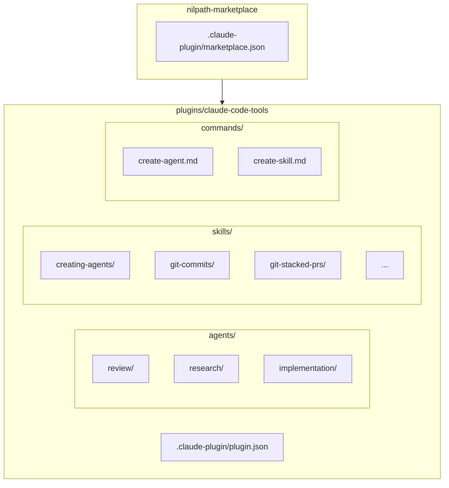

# nilpath-marketplace

Claude Code plugin marketplace with **1 agent**, **7 skills**, and **2 commands**.

## Structure

## Organization

### Agents

Agents are grouped into category folders by type:

| Category | Path | Purpose |
|----------|------|---------|
| review | `agents/review/` | Code review, audits |
| research | `agents/research/` | Exploration, analysis |
| implementation | `agents/implementation/` | Code writing, fixes |

### Skills

Skills use kebab-case directories with standard subdirectories:

| Directory | Purpose |
|-----------|---------|
| `SKILL.md` | Entry point (< 500 lines) |
| `references/` | Quick syntax guides (~50 lines each) |
| `templates/` | Copy-paste starters |
| `workflows/` | Step-by-step guides |
| `scripts/` | Automation scripts |

## Quick Reference

| Concept | Description | Details |
|---------|-------------|---------|
| **Plugin** | Distribution unit containing agents, skills, commands | [plugin.json spec](ai_docs/release-workflow.md) |
| **Skill** | Expert knowledge base with references and templates | [Skill Architecture](ai_docs/skill-architecture.md) |
| **Agent** | Specialized subagent for focused tasks | [Agent Architecture](ai_docs/agent-architecture.md) |
| **Command** | Slash command entry point for skills | `commands/*.md` |

## Common Tasks

### Add a Skill

1. Create `plugins/claude-code-tools/skills/<name>/SKILL.md`
2. Add `references/`, `templates/`, `workflows/` as needed
3. Update 4 files (see [Version Sync](#version-sync))

### Add an Agent

1. Create `plugins/claude-code-tools/agents/<category>/<name>.md`
2. Choose category: `review/`, `research/`, or `implementation/`
3. Update 4 files (see [Version Sync](#version-sync))

### Release Changes

See [Release Workflow](ai_docs/release-workflow.md) for the complete process.

## Version Sync

**Critical:** Every change MUST update these 4 files:

| File | Path | Update |
|------|------|--------|
| plugin.json | `plugins/claude-code-tools/.claude-plugin/plugin.json` | Version bump |
| marketplace.json | `.claude-plugin/marketplace.json` | Sync plugin version |
| README.md | `plugins/claude-code-tools/README.md` | Component counts |
| CHANGELOG.md | `plugins/claude-code-tools/CHANGELOG.md` | Document changes |

### Version Rules

- **MAJOR** (1.0.0 → 2.0.0): Breaking changes
- **MINOR** (1.0.0 → 1.1.0): New agent, skill, or command
- **PATCH** (1.0.0 → 1.0.1): Bug fixes, doc updates

## Deep Dives

| Topic | Link |
|-------|------|
| Skill structure, YAML spec, patterns | [ai_docs/skill-architecture.md](ai_docs/skill-architecture.md) |
| Agent design, tools, delegation | [ai_docs/agent-architecture.md](ai_docs/agent-architecture.md) |
| Release process, 4-file sync | [ai_docs/release-workflow.md](ai_docs/release-workflow.md) |

## Current Components

### Agents (1)

- **code-reviewer** - Code quality, security, best practices review with GitHub PR comments

### Skills (7)

| Skill | Purpose |
|-------|---------|
| creating-agents | Design and implement Claude Code subagents |
| create-agent-skills | Create and refine Claude Code Skills |
| creating-mermaid-diagrams | Create, edit, validate Mermaid diagrams |
| gh-pr-review | GitHub PR review operations |
| git-commits | Commit best practices |
| git-stacked-prs | Stacked PR workflow |
| git-advanced | Advanced git operations |

### Commands (2)

- `/create-agent` - Invoke creating-agents skill
- `/create-skill` - Invoke create-agent-skills skill
