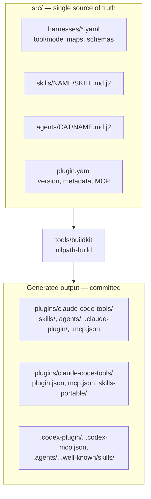

# nilpath-marketplace

Tri-client marketplace with **12 agents** and **15 skills**, authored once under `src/` and built for **Claude Code**, **GitHub Copilot (VS Code)**, and **Codex**.

## Critical rule: src/ is the only editable source

Everything under `plugins/`, `.claude-plugin/`, `.agents/`, and `.well-known/` is **GENERATED by `nilpath-build`**. Never edit those files directly — edit the matching template under `src/` and rebuild:

```bash
make build    # render src/ -> all harness outputs (commit sources AND output)
make check    # CI gate: fails if committed output drifts from src/
```

## Structure


```mermaid
flowchart TD
    subgraph SRC[src/ — single source of truth]
        HARNESS[harnesses/*.yaml<br/>tool/model maps, schemas]
        SKILLS[skills/NAME/SKILL.md.j2]
        AGENTS[agents/CAT/NAME.md.j2]
        META[plugin.yaml<br/>version, metadata, MCP]
    end

    BUILD[tools/buildkit<br/>nilpath-build]

    subgraph OUT[Generated output — committed]
        CLAUDE[plugins/claude-code-tools/<br/>skills/, agents/, .claude-plugin/, .mcp.json]
        COPILOT[plugins/claude-code-tools/<br/>plugin.json, mcp.json, skills-portable/]
        CODEX[.codex-plugin/, .codex-mcp.json,<br/>.agents/, .well-known/skills/]
    end

    SRC --> BUILD --> OUT
```

## Authoring conventions

Sources use the **canonical vocabulary** from `src/harnesses/tools.yaml`, never harness-specific names:

| Axis | Canonical values | Rendered per harness via |
| --- | --- | --- |
| tools | `shell(git:*)`, `file-read`, `file-write`, `file-edit`, `glob-search`, `content-search`, `web-fetch`, `web-search`, `subagent(x)`, `skill(x)`, `ask-user`, `todo` | `tools.map` in `src/harnesses/<h>.yaml` |
| model | `small`, `medium`, `large`, `xlarge` (ordered, extensible) | `models.map` |
| reasoning | `minimal`, `low`, `medium`, `high`, `max` | `reasoning.key` + `reasoning.map` |

- Frontmatter must declare `targets:` (`[claude]` or `[claude, copilot, codex]`).
- Harness passthrough for names outside the vocabulary: `claude:mcp__server__tool`.
- Harness-specific content uses `…`; script paths use `{{ skill_root }}`.
- Templating is opt-in per file via the `.j2` suffix; other files copy verbatim.

## Common Tasks

### Add a skill

1. `~/.virtualenvs/nilpath-marketplace/bin/nilpath-build new-skill <name>` (or copy an existing `src/skills/` dir)
2. Author `src/skills/<name>/SKILL.md.j2` with canonical frontmatter
3. `make build`, then update version files (see below)

### Add an agent

1. Create `src/agents/<category>/<name>.md.j2` (categories: review, research, implementation, planning)
2. `make build`, then update version files

### Release changes

See [ai_docs/release-workflow.md](ai_docs/release-workflow.md).

## Version Sync

The build propagates the version from **`src/plugin.yaml`** into every generated manifest. A release updates:

| File | Update |
| --- | --- |
| `src/plugin.yaml` | Version bump (single source) |
| `plugins/claude-code-tools/CHANGELOG.md` | Document changes |
| `plugins/claude-code-tools/README.md` + root `README.md` | Component counts / portability matrix |
| generated manifests | via `make build` (never by hand) |

### Version rules

- **MAJOR**: breaking changes
- **MINOR**: new agent or skill
- **PATCH**: bug fixes, doc updates

## Current Components

- **Agents (12, Claude-only)**: review (code-reviewer, doc-auditor, plan-reviewer, spec-reviewer), research (api-integration-researcher, architecture-researcher, docs-library-researcher), implementation (code-debugger, coding-task-agent, python-task-agent, doc-writer), planning (task-decomposer)
- **Skills (15)**: portable to all three clients — creating-mermaid-diagrams, engineering-principles, gh-address-comments, gh-pr-review, git-advanced, git-commits, git-stacked-prs, using-git-worktrees; Claude-only — creating-agents, creating-skills, executing-plan, performing-code-review, planning, researching, writing-documentation

## Deep Dives

| Topic | Link |
| --- | --- |
| Skill structure, YAML spec, patterns | [ai_docs/skill-architecture.md](ai_docs/skill-architecture.md) |
| Agent design, tools, delegation | [ai_docs/agent-architecture.md](ai_docs/agent-architecture.md) |
| Release process, version sync | [ai_docs/release-workflow.md](ai_docs/release-workflow.md) |
