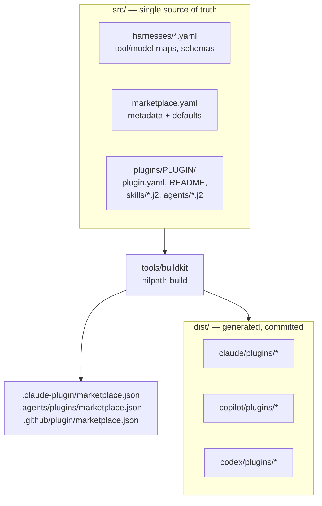

# nilpath-marketplace

Tri-client marketplace: **4 plugins** (12 agents, 15 skills) authored once under `src/` and built into per-harness trees under `dist/` for **Claude Code**, **GitHub Copilot (VS Code)**, and **Codex**.

## Critical rule: src/ is the only editable source

`dist/` and the three root registries (`.claude-plugin/marketplace.json`, `.agents/plugins/marketplace.json`, `.github/plugin/marketplace.json`) are **GENERATED by `nilpath-build`**. Never edit them — edit the matching template under `src/plugins/<plugin>/` and rebuild:

```bash
make build    # render src/ -> dist/ (commit sources AND output)
make check    # CI gate: fails if committed output drifts from src/
```

## Structure


```mermaid
flowchart TD
    subgraph SRC[src/ — single source of truth]
        HARNESS[harnesses/*.yaml<br/>tool/model maps, schemas]
        MKT[marketplace.yaml<br/>metadata + defaults]
        PLUGINS[plugins/PLUGIN/<br/>plugin.yaml, README,<br/>skills/*.j2, agents/*.j2]
    end

    BUILD[tools/buildkit<br/>nilpath-build]

    subgraph DIST[dist/ — generated, committed]
        CLAUDE[claude/plugins/*]
        COPILOT[copilot/plugins/*]
        CODEX[codex/plugins/*]
    end

    REG[.claude-plugin/marketplace.json<br/>.agents/plugins/marketplace.json<br/>.github/plugin/marketplace.json]

    SRC --> BUILD --> DIST
    BUILD --> REG
```

## Plugins

| Plugin | Skills | Agents |
| --- | --- | --- |
| git-tools | git-commits, git-advanced, git-stacked-prs, using-git-worktrees, gh-pr-review, gh-address-comments | — |
| engineering-workflow | researching, planning, executing-plan, performing-code-review, engineering-principles | task-decomposer; spec/plan/code reviewers; api/architecture/docs researchers; code-debugger; coding/python task agents |
| documentation | writing-documentation, creating-mermaid-diagrams | doc-writer, doc-auditor |
| authoring-tools | creating-agents, creating-skills | — |

Cross-plugin references are plugin-qualified (e.g. `Skill(git-tools:git-commits)`, `documentation:implementation:doc-writer`). engineering-workflow depends on git-tools and documentation.

## Authoring conventions

Sources use the **canonical vocabulary** from `src/harnesses/tools.yaml`, never harness-specific names:

| Axis | Canonical values | Rendered per harness via |
| --- | --- | --- |
| tools | `shell(git:*)`, `file-read`, `file-write`, `file-edit`, `glob-search`, `content-search`, `web-fetch`, `web-search`, `subagent(x)`, `skill(x)`, `ask-user`, `todo` | `tools.map` in `src/harnesses/<h>.yaml` |
| model | `small`, `medium`, `large`, `xlarge` (ordered, extensible) | `models.map` |
| reasoning | `minimal`, `low`, `medium`, `high`, `max` | `reasoning.key` + `reasoning.map` |

- Frontmatter must declare `targets:` (`[claude]` or `[claude, copilot, codex]`).
- Harness passthrough for names outside the vocabulary: `claude:mcp__server__tool`.
- Harness-specific content uses `…`; script paths use `{{ skill_root }}`.
- Templating is opt-in per file via the `.j2` suffix; other files copy verbatim.

**Prose helpers** (from `prose:` in `src/harnesses/<h>.yaml`) render orchestration phrasing in each harness's native mechanism — use these instead of writing `Agent(...)`/`TodoWrite`/`AskUserQuestion` literally:

| Helper | Claude render | Copilot/Codex render |
| --- | --- | --- |
| `{{ spawn('plugin:cat:agent') }}` | `` `Agent(subagent_type="…")` `` | "the `agent` custom agent…" / "the `agent` agent (spawn it as a subagent)" |
| `{{ skill_ref('plugin:skill') }}` | "the `plugin:skill` skill" | "the `skill` skill (`/skill`)" / "the `skill` skill" |
| `{{ todo }}` | "the `TodoWrite` tool" | "the todo list" / "the plan tool (`update_plan`)" |
| `{{ ask_user }}` | "the `AskUserQuestion` tool" | "a direct chat question to the user (…)" |

A plugin with zero components for a harness is skipped entirely in that harness's `dist/` tree and registry (e.g. authoring-tools exists only under `dist/claude/`).

## Common Tasks

### Add a skill

1. `~/.virtualenvs/nilpath-marketplace/bin/nilpath-build new-skill <name> --plugin <plugin>`
2. Author `src/plugins/<plugin>/skills/<name>/SKILL.md.j2` with canonical frontmatter
3. `make build`, then update version files (see below)

### Add an agent

1. Create `src/plugins/<plugin>/agents/<category>/<name>.md.j2` (categories: review, research, implementation, planning)
2. `make build`, then update version files

### Release changes

See [ai_docs/release-workflow.md](ai_docs/release-workflow.md).

## Version Sync

The build propagates versions from **`src/plugins/<plugin>/plugin.yaml`** (and `src/marketplace.yaml`) into every generated manifest. A release updates:

| File | Update |
| --- | --- |
| `src/plugins/<plugin>/plugin.yaml` | Version bump for each changed plugin |
| `CHANGELOG.md` (repo root) | Document changes |
| root `README.md` + `src/plugins/<plugin>/README.md` | Component tables |
| generated manifests | via `make build` (never by hand) |

### Version rules

- **MAJOR**: breaking changes
- **MINOR**: new agent or skill
- **PATCH**: bug fixes, doc updates

## Deep Dives

| Topic | Link |
| --- | --- |
| Skill structure, YAML spec, patterns | [ai_docs/skill-architecture.md](ai_docs/skill-architecture.md) |
| Agent design, tools, delegation | [ai_docs/agent-architecture.md](ai_docs/agent-architecture.md) |
| Release process, version sync | [ai_docs/release-workflow.md](ai_docs/release-workflow.md) |
