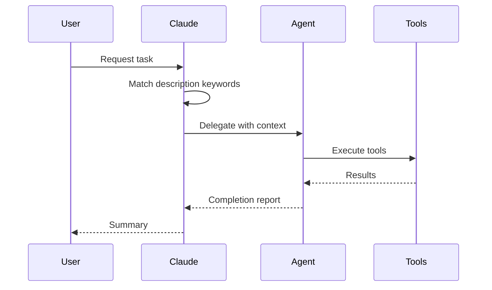
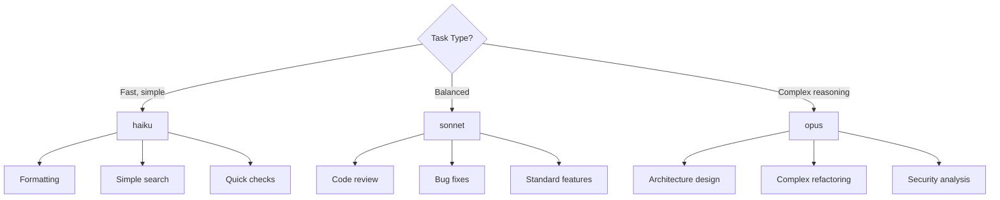
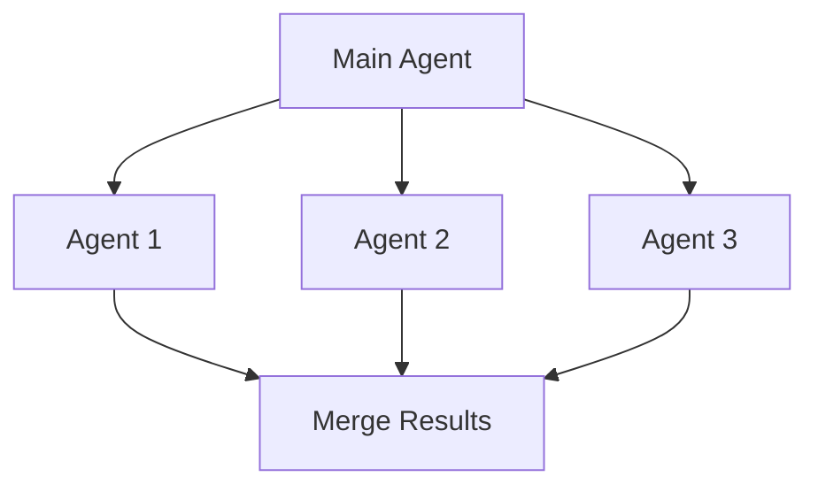
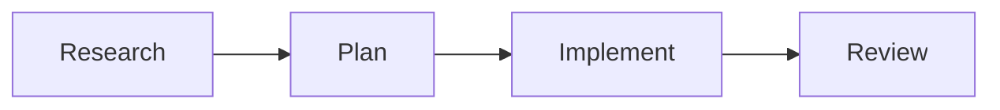
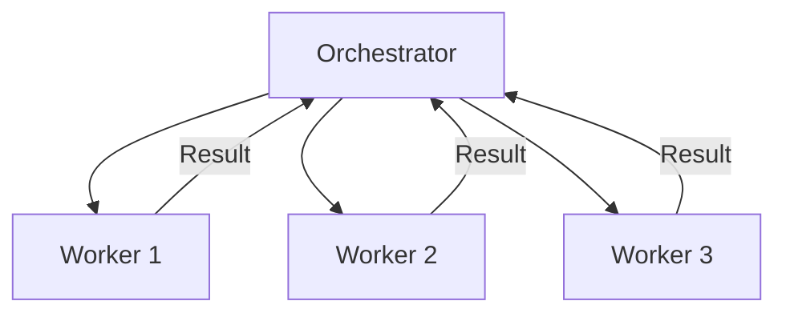

# Agent Architecture

Deep dive into Claude Code agent design and delegation patterns.

## Agent Delegation Flow



## Agent Definition Format

Agents are defined in markdown files with YAML frontmatter:

```yaml
---
name: agent-name
description: Expert at X. Use when Y or Z.
tools: Read, Glob, Grep
skills:
  - required-skill
model: sonnet
---

# Agent Name

System prompt instructions here...
```

### Field Reference

| Field | Required | Description |
|-------|----------|-------------|
| `name` | Yes | Unique identifier |
| `description` | Yes | Capabilities + trigger keywords |
| `tools` | Yes | Available tools |
| `skills` | No | Preloaded skills |
| `model` | No | haiku, sonnet, opus |

## Directory Organization

Agents are grouped by category:

```
agents/
├── review/           # Code review agents
│   └── code-reviewer.md
├── research/         # Research and exploration
│   └── codebase-explorer.md
└── implementation/   # Code writing agents
    └── feature-builder.md
```

## Tool Permissions by Role

| Role | Tools | Rationale |
|------|-------|-----------|
| **Reviewer** | Read, Glob, Grep | Read-only analysis |
| **Researcher** | Read, Glob, Grep, WebFetch | Information gathering |
| **Implementer** | Read, Write, Edit, Bash | Code modification |

## Model Selection Guide



## Orchestration Patterns

### Fan-Out (Parallel)



Use when tasks are independent and can run simultaneously.

### Pipeline (Sequential)



Use when each step depends on the previous result.

### Orchestrator-Worker



Use for dynamic task distribution with coordination.

## Description Keywords

Include trigger words in agent descriptions for proper delegation:

| Domain | Keywords |
|--------|----------|
| Review | review, audit, check, analyze, quality |
| Security | security, vulnerability, OWASP, CVE |
| Performance | performance, optimize, profile, benchmark |
| Testing | test, coverage, unit, integration |
| Documentation | docs, readme, comments, jsdoc |

## Skills Dependencies

Agents can preload skills for specialized knowledge:

```yaml
skills:
  - gh-pr-review      # GitHub PR operations
  - git-stacked-prs   # Stacked PR workflow
```

Skills are loaded before the agent starts working.

## See Also

- [Skill Architecture](skill-architecture.md)
- [Release Workflow](release-workflow.md)
- [Official Agent Docs](https://code.claude.com/docs/en/sub-agents)
