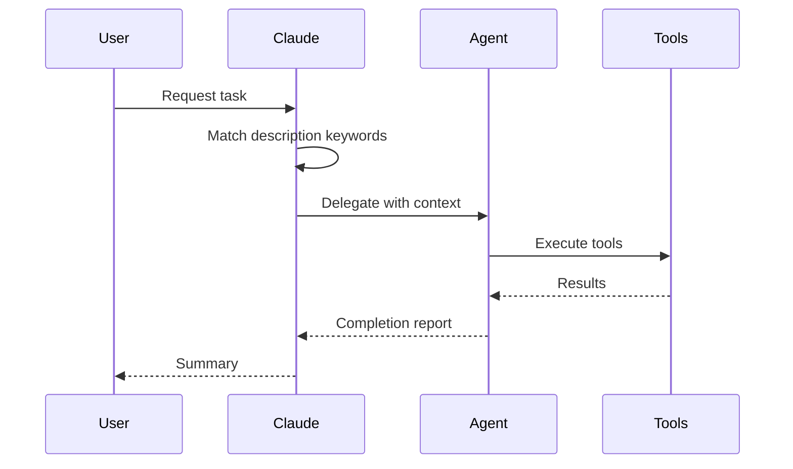
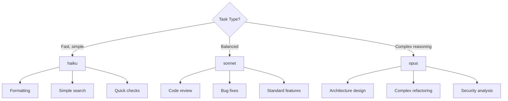
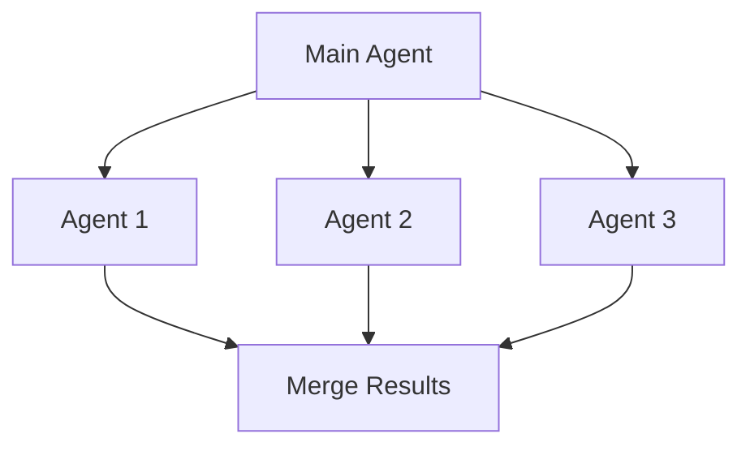
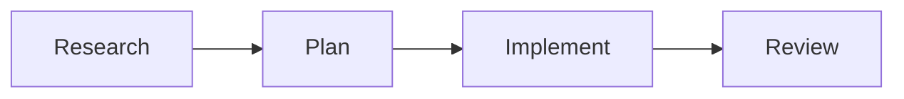
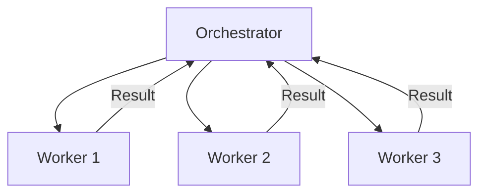

# Agent Architecture

Quick reference for agent design. For detailed guidance, use: `/create-agent`

## Agent Delegation Flow



## Directory Organization

Agents are grouped by category:

```
agents/
├── review/           # Code review agents
│   └── code-reviewer.md
├── research/         # Research and exploration
│   └── codebase-explorer.md
└── implementation/   # Code writing agents
    └── feature-builder.md
```

## Model Selection Guide



## Orchestration Patterns

### Fan-Out (Parallel)



Use when tasks are independent and can run simultaneously.

### Pipeline (Sequential)



Use when each step depends on the previous result.

### Orchestrator-Worker



Use for dynamic task distribution with coordination.

## Quick Reference

| Role | Tools | Use For |
|------|-------|---------|
| Reviewer | Read, Glob, Grep | Read-only analysis |
| Researcher | Read, Glob, Grep, WebFetch | Information gathering |
| Implementer | Read, Write, Edit, Bash | Code modification |

## See Also

- [Skill Architecture](skill-architecture.md)
- [Release Workflow](release-workflow.md)
- [Official Agent Docs](https://code.claude.com/docs/en/sub-agents)
