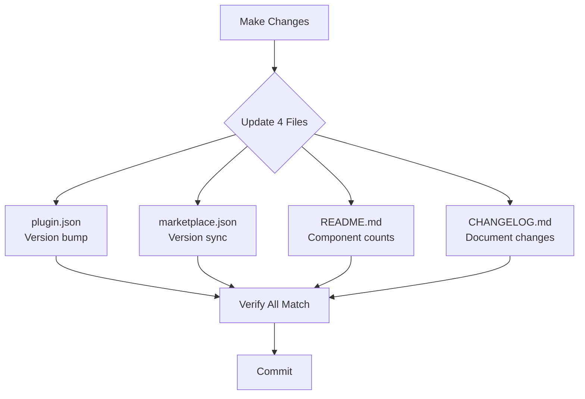
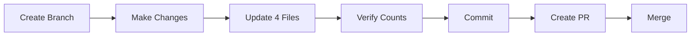

# Release Workflow

Complete guide for releasing changes to the plugin.

## 4-File Sync Requirement

Every change MUST update these files together:



## File Locations

| File | Path | Updates |
|------|------|---------|
| plugin.json | `plugins/claude-code-tools/.claude-plugin/plugin.json` | Version |
| marketplace.json | `.claude-plugin/marketplace.json` | Plugin version |
| README.md | `plugins/claude-code-tools/README.md` | Component counts, tables |
| CHANGELOG.md | `plugins/claude-code-tools/CHANGELOG.md` | Change documentation |

## Version Bumping Rules

Follow [Semantic Versioning](https://semver.org/):

| Change Type | Version Bump | Example |
|-------------|--------------|---------|
| Breaking changes | MAJOR | 1.0.0 → 2.0.0 |
| New agent/skill/command | MINOR | 1.0.0 → 1.1.0 |
| Bug fixes, doc updates | PATCH | 1.0.0 → 1.0.1 |

## Pre-Commit Checklist

```markdown
- [ ] Version bumped in plugin.json
- [ ] Version updated in marketplace.json
- [ ] README.md component counts accurate
- [ ] README.md tables updated (agents, skills, commands)
- [ ] CHANGELOG.md entry added with date
```

## Component Counting

Verify counts match actual files:

```bash
# Count agents
find plugins/claude-code-tools/agents -name "*.md" | wc -l

# Count skills
ls -d plugins/claude-code-tools/skills/*/ | wc -l

# Count commands
find plugins/claude-code-tools/commands -name "*.md" | wc -l
```

## CHANGELOG Format

Follow [Keep a Changelog](https://keepachangelog.com/):

```markdown
## [X.Y.Z] - YYYY-MM-DD

### Added
- New feature description

### Changed
- Modified feature description

### Fixed
- Bug fix description

### Removed
- Removed feature description
```

## Release Process



### Step-by-Step

1. **Create feature branch**
   ```bash
   git checkout -b feat/description
   ```

2. **Make changes** (add/modify agents, skills, commands)

3. **Update plugin.json** - Bump version
   ```json
   { "version": "0.6.0" }
   ```

4. **Update marketplace.json** - Sync version
   ```json
   { "plugins": [{ "version": "0.6.0" }] }
   ```

5. **Update README.md** - Verify counts and tables

6. **Update CHANGELOG.md** - Document changes with date

7. **Commit and PR**
   ```bash
   git add -A
   git commit -m "feat: Add new-feature (vX.Y.Z)"
   git push -u origin feat/description
   gh pr create
   ```

## See Also

- [Skill Architecture](skill-architecture.md)
- [Agent Architecture](agent-architecture.md)
