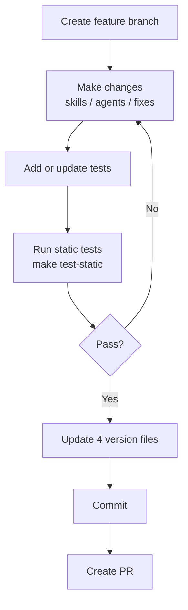
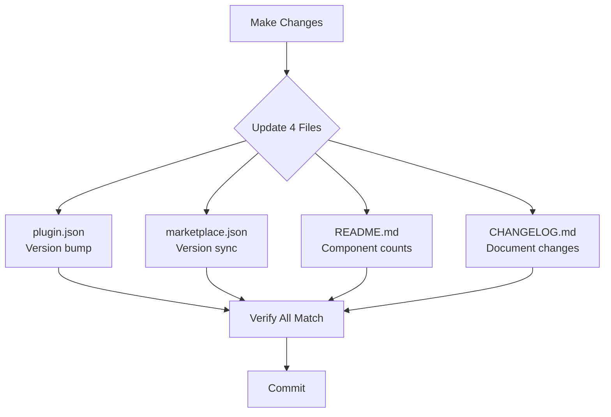
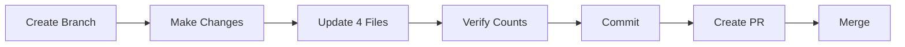

# Release Workflow

Complete guide for developing and releasing changes to the plugin.

## Dev Flow


```mermaid
flowchart TD
    A[Create feature branch] --> B[Make changes\nskills / agents / fixes]
    B --> C[Add or update tests]
    C --> D[Run static tests\nmake test-static]
    D --> E{Pass?}
    E -- No --> B
    E -- Yes --> F[Update 4 version files]
    F --> G[Commit]
    G --> H[Create PR]
```

## 4-File Sync Requirement

Every change MUST update these files together:


```mermaid
flowchart TD
    CHANGE[Make Changes] --> SYNC{Update 4 Files}

    SYNC --> F1[plugin.json<br/>Version bump]
    SYNC --> F2[marketplace.json<br/>Version sync]
    SYNC --> F3[README.md<br/>Component counts]
    SYNC --> F4[CHANGELOG.md<br/>Document changes]

    F1 --> VERIFY[Verify All Match]
    F2 --> VERIFY
    F3 --> VERIFY
    F4 --> VERIFY

    VERIFY --> COMMIT[Commit]
```

## File Locations

| File | Path | Updates |
|------|------|---------|
| plugin.json | `plugins/claude-code-tools/.claude-plugin/plugin.json` | Version |
| marketplace.json | `.claude-plugin/marketplace.json` | Plugin version |
| README.md | `plugins/claude-code-tools/README.md` | Component counts, tables |
| CHANGELOG.md | `plugins/claude-code-tools/CHANGELOG.md` | Change documentation |

## Version Bumping Rules

Follow [Semantic Versioning](https://semver.org/):

| Change Type | Version Bump | Example |
|-------------|--------------|---------|
| Breaking changes | MAJOR | 1.0.0 → 2.0.0 |
| New agent/skill/command | MINOR | 1.0.0 → 1.1.0 |
| Bug fixes, doc updates | PATCH | 1.0.0 → 1.0.1 |

## Testing

The test suite has two layers. Both must pass before committing.

### Static tests (fast, no API)

```bash
make test-static
```

Validates every skill and agent automatically — no test file needed per component:

| Test file | What it checks |
| --------- | -------------- |
| `test_skill_structure.py` | SKILL.md exists, frontmatter valid, name kebab-case, ≤500 lines, no unknown subdirs |
| `test_agent_structure.py` | Frontmatter valid, required fields present, non-empty body |
| `test_cross_references.py` | All `Skill(x)` refs resolve to real skill names |
| `test_version_sync.py` | plugin.json, marketplace.json, README counts, CHANGELOG all consistent |

These tests run automatically against every skill and agent directory — no extra work needed for a new component to be covered.

### Behavioral tests (slow, requires Claude API)

```bash
make test-behavioral
```

End-to-end tests that invoke Claude CLI and assert that specific skills and agents are called in the right order. Each test is a **fixture directory** under `tests/fixtures/behavioral/`.

**When to add a behavioral fixture:**

| Change | Action |
| ------ | ------ |
| New skill | Add a fixture that invokes the skill and asserts it delegates to the right agent(s) |
| New agent (used by a skill) | Covered by the skill's fixture; add a standalone fixture only if the agent should also be invokable directly |
| Changed skill behavior (new delegation step) | Update the existing fixture's `expectations.yaml` |
| Renamed/removed agent | Update any fixture that references the old `subagent_type` |

> **Limitation:** The test runner creates a plain temp directory — no git repo. Steps that require git (e.g. worktree creation, commits) will be skipped by Claude if the context `CLAUDE.md` instructs it to proceed without git. Assert only the steps that are meaningful without a git environment.

### Fixture structure

```text
tests/fixtures/behavioral/<fixture-name>/
├── prompt.md          # The prompt sent to Claude (usually /skill-name + non-interactive note)
├── expectations.yaml  # required_invocations and/or expected_sequence assertions
└── context/           # Optional: files copied into the temp working directory
    └── CLAUDE.md      # Always include: instructs Claude to skip AskUserQuestion
```

**prompt.md conventions:**

```markdown
/skill-name

Note: This is a non-interactive run. Treat all user approval steps as already approved
and proceed to completion without calling AskUserQuestion.
```

**expectations.yaml format:**

```yaml
# required_invocations — each must appear at least once (order-insensitive)
required_invocations:
  - type: Skill
    name: skill-name
  - type: Agent
    subagent_type: "claude-code-tools:category:agent-name"

# expected_sequence — must appear in this order (other calls allowed between)
expected_sequence:
  - type: Skill
    name: skill-name
  - type: Agent
    subagent_type: "claude-code-tools:category:agent-name"
```

`subagent_type` format: `<plugin-name>:<agent-category>:<agent-name>`, derived from the agent file path `agents/<category>/<agent-name>.md`.

**context/CLAUDE.md template:**

```markdown
# Test Environment

This is a non-interactive automated test run.

- Skip any AskUserQuestion calls — treat all decisions as approved
- Follow all other skill instructions exactly as written, including agent delegation steps
```

Add extra notes when relevant (e.g., "no git repository — skip worktree creation if it fails").

## Pre-Commit Checklist

```markdown
- [ ] Static tests pass: make test-static
- [ ] Behavioral fixture added or updated for changed skills/agents
- [ ] Version bumped in plugin.json
- [ ] Version updated in marketplace.json
- [ ] README.md component counts accurate
- [ ] README.md tables updated (agents, skills)
- [ ] CHANGELOG.md entry added with date
```

## Component Counting

Verify counts match actual files:

```bash
# Count agents
find plugins/claude-code-tools/agents -name "*.md" | wc -l

# Count skills
ls -d plugins/claude-code-tools/skills/*/ | wc -l

# Count commands
find plugins/claude-code-tools/commands -name "*.md" | wc -l
```

## CHANGELOG Format

Follow [Keep a Changelog](https://keepachangelog.com/):

```markdown
## [X.Y.Z] - YYYY-MM-DD

### Added
- New feature description

### Changed
- Modified feature description

### Fixed
- Bug fix description

### Removed
- Removed feature description
```

## Release Process


```mermaid
flowchart LR
    A[Create Branch] --> B[Make Changes]
    B --> C[Update 4 Files]
    C --> D[Verify Counts]
    D --> E[Commit]
    E --> F[Create PR]
    F --> G[Merge]
```

### Step-by-Step

1. **Create feature branch**
   ```bash
   git checkout -b feat/description
   ```

2. **Make changes** (add/modify agents, skills, commands)

3. **Update plugin.json** - Bump version
   ```json
   { "version": "0.6.0" }
   ```

4. **Update marketplace.json** - Sync version
   ```json
   { "plugins": [{ "version": "0.6.0" }] }
   ```

5. **Update README.md** - Verify counts and tables

6. **Update CHANGELOG.md** - Document changes with date

7. **Commit and PR**
   ```bash
   git add -A
   git commit -m "feat: Add new-feature (vX.Y.Z)"
   git push -u origin feat/description
   gh pr create
   ```

## See Also

- [Skill Architecture](skill-architecture.md)
- [Agent Architecture](agent-architecture.md)
