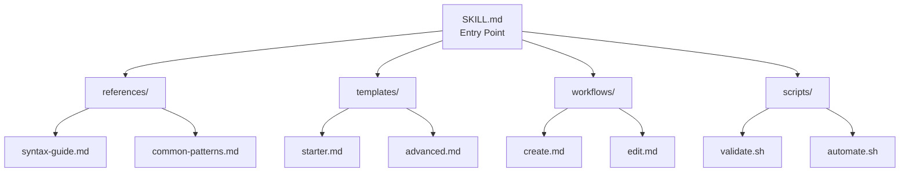
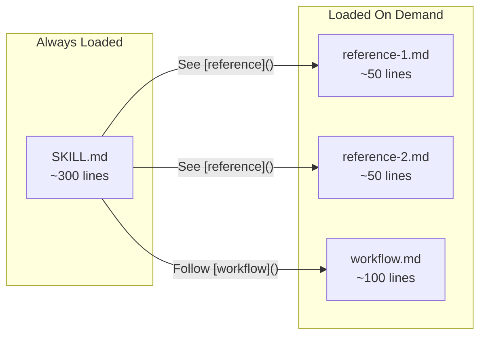

# Skill Architecture

Deep dive into Claude Code skill structure and patterns.

## Directory Structure



## YAML Frontmatter Specification

Every skill requires a `SKILL.md` with YAML frontmatter:

```yaml
---
name: skill-name                      # Required: lowercase, hyphens only
description: What it does and when    # Required: include trigger keywords
allowed-tools: Read, Write, Edit      # Optional: tool permissions
model: sonnet                         # Optional: haiku | sonnet | opus
---
```

### Field Reference

| Field | Required | Description |
|-------|----------|-------------|
| `name` | Yes | Unique identifier (max 64 chars) |
| `description` | Yes | What + when to use (max 1024 chars) |
| `allowed-tools` | No | Comma-separated tool list |
| `model` | No | Force specific model |

### Tool Permission Syntax

```yaml
# Basic tools
allowed-tools: Read, Write, Edit, Glob, Grep

# Bash with restrictions
allowed-tools: Bash(git:*), Bash(npm:*)

# Combined
allowed-tools: Read, Write, Bash(npx:*)
```

## Progressive Disclosure Pattern

Keep SKILL.md under 500 lines by splitting content:



### SKILL.md Structure

```markdown
# Skill Name

## Quick Start
[Minimal working example - 10-20 lines]

## What Would You Like To Do?
1. Task A → [Link to workflow]
2. Task B → [Link to workflow]
3. Learn syntax → [Link to reference]

## Quick Reference
[Essential info - tables preferred]

## Guidelines
[Rules and constraints]

## References
[Links to detailed docs]
```

## Reference File Guidelines

Reference files should be ~50 lines each:

- **Purpose**: Quick syntax guide for one topic
- **Pattern**: Problem → Solution → Example → Link to official docs
- **Naming**: `<topic>-syntax.md` or `<topic>-reference.md`

Example structure:

```markdown
# Topic Reference

Quick reference for [topic]. For complete docs, see [official link].

## Basic Syntax

[Code example]

## Common Patterns

| Pattern | Example |
|---------|---------|
| ... | ... |

## See Also

- [Official docs](https://...)
```

## Templates vs Workflows

| Component | Purpose | Content |
|-----------|---------|---------|
| **Templates** | Copy-paste starters | Ready-to-use code/config |
| **Workflows** | Step-by-step guides | Instructions + decision points |

## Scripts Directory

Scripts are executed, not loaded into context:

```bash
# scripts/validate.sh
#!/bin/bash
set -e
# ... validation logic
echo '{"valid": true}'
```

- Use JSON output for machine-readable results
- Include `--help` flag
- Handle errors explicitly
- Keep under 200 lines each

## Naming Conventions

- **Skill name**: `creating-*`, `managing-*`, `processing-*` (gerund form)
- **References**: `*-syntax.md`, `*-reference.md`, `*-patterns.md`
- **Templates**: Descriptive name matching use case
- **Workflows**: `create-*.md`, `edit-*.md`, `update-*.md`
- **Scripts**: `validate-*.sh`, `*-status.sh`, `*-backup.sh`

## Anti-Patterns

| Anti-Pattern | Problem | Solution |
|--------------|---------|----------|
| SKILL.md > 500 lines | Context overload | Split into references |
| Deep nesting | Hard to navigate | Keep refs one level deep |
| Vague description | Poor discovery | Include trigger keywords |
| No examples | Unclear usage | Add Quick Start section |
| Scripts without error handling | Silent failures | Use `set -e`, explicit checks |

## See Also

- [Agent Architecture](agent-architecture.md)
- [Release Workflow](release-workflow.md)
- [Official Skills Docs](https://code.claude.com/docs/en/skills)
