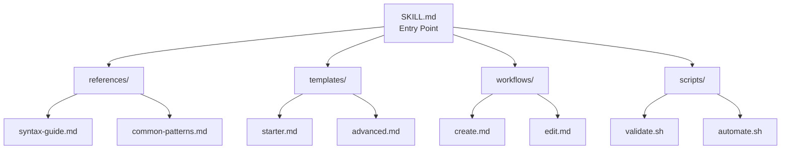
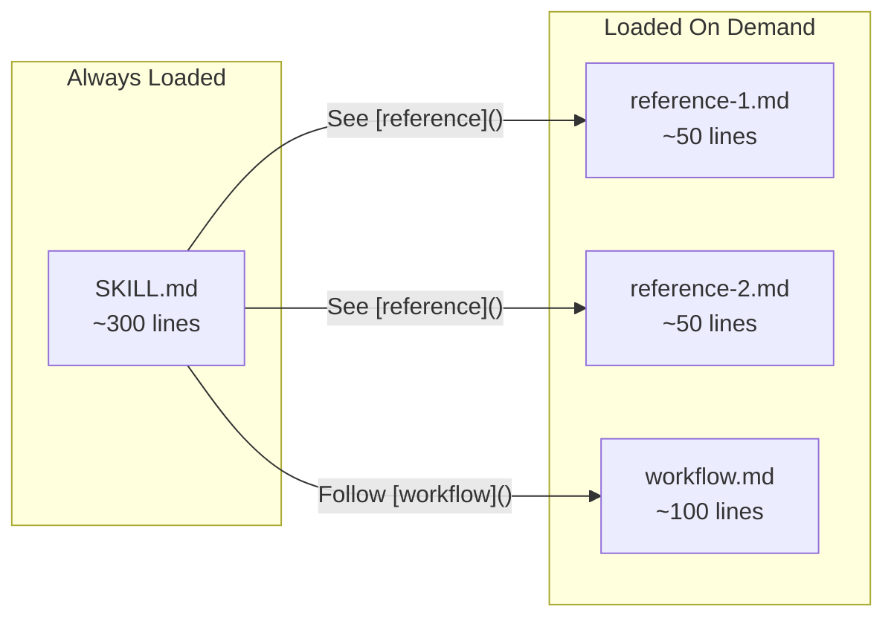

# Skill Architecture

Quick reference for skill structure. For detailed guidance, use: `/create-skill`

## Directory Structure

## Progressive Disclosure Pattern

## Quick Reference

| Component | Purpose | Line Limit |
|-----------|---------|------------|
| SKILL.md | Entry point with quick start | ~500 |
| references/ | Syntax guides, patterns | ~50 each |
| templates/ | Copy-paste starters | varies |
| workflows/ | Step-by-step guides | ~100 each |
| scripts/ | Automation (executed, not loaded) | ~200 each |

## Naming Conventions

| Type | Pattern | Examples |
|------|---------|----------|
| Skill name | `creating-*`, `managing-*` | `creating-agents`, `git-commits` |
| References | `*-syntax.md`, `*-patterns.md` | `common-patterns.md` |
| Workflows | `create-*.md`, `edit-*.md` | `create-new.md` |
| Scripts | `validate-*.sh` | `validate-diagram.sh` |

## See Also

- [Agent Architecture](agent-architecture.md)
- [Release Workflow](release-workflow.md)
- [Official Skills Docs](https://code.claude.com/docs/en/skills)
