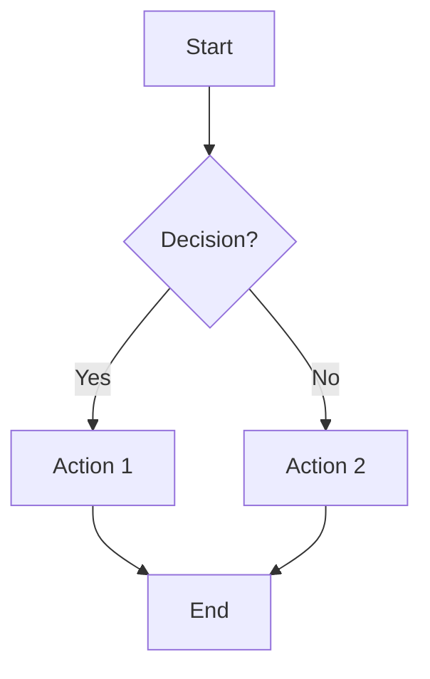
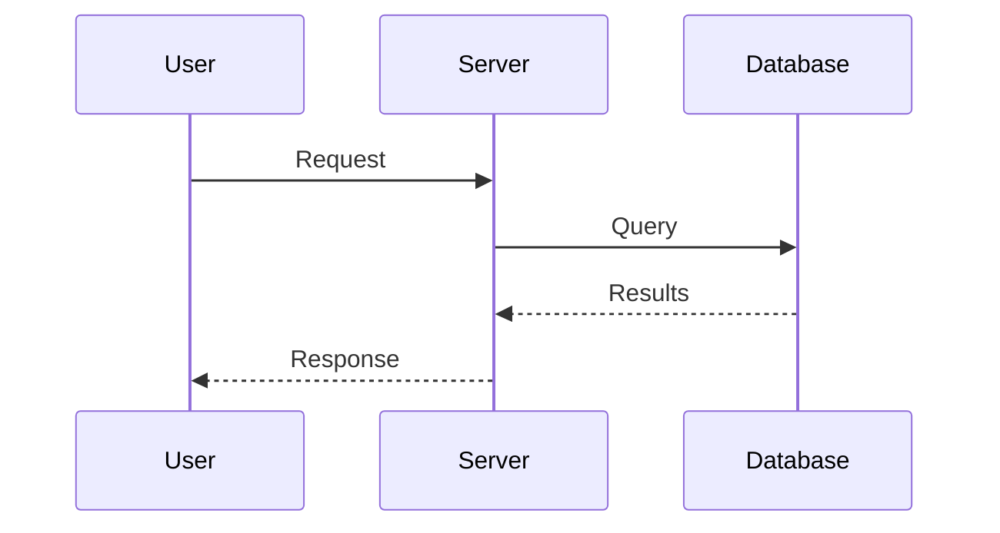
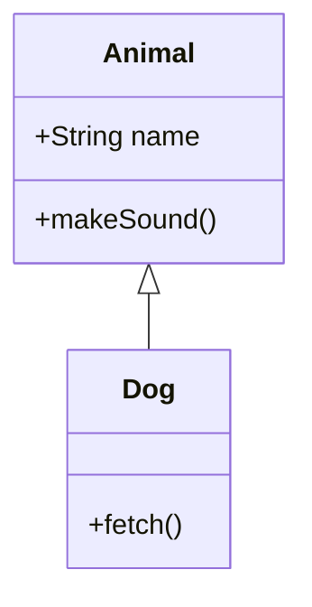

# Creating Mermaid Diagrams

Expert guidance for creating, editing, and validating Mermaid diagrams.

## Supported Diagram Types

| Type | Use Case | Reference |
|------|----------|-----------|
| **Flowchart** | Process flows, decision trees, algorithms | [flowchart-syntax.md](references/flowchart-syntax.md) |
| **Sequence** | API calls, service interactions, protocols | [sequence-diagram-syntax.md](references/sequence-diagram-syntax.md) |
| **Class** | OOP design, type hierarchies, interfaces | [class-diagram-syntax.md](references/class-diagram-syntax.md) |
| **State** | State machines, lifecycle, FSMs | [state-diagram-syntax.md](references/state-diagram-syntax.md) |
| **ER** | Database schema, data models | [entity-relationship-syntax.md](references/entity-relationship-syntax.md) |
| **Gantt** | Project timelines, schedules | [gantt-chart-syntax.md](references/gantt-chart-syntax.md) |
| **Pie** | Proportions, distributions | [pie-chart-syntax.md](references/pie-chart-syntax.md) |
| **Mindmap** | Brainstorming, hierarchies | [mindmap-syntax.md](references/mindmap-syntax.md) |
| **Timeline** | Historical events, milestones | [timeline-syntax.md](references/timeline-syntax.md) |
| **Git Graph** | Branch visualization | [gitgraph-syntax.md](references/gitgraph-syntax.md) |

## Quick Start

### Flowchart



### Sequence Diagram



### Class Diagram



## What Would You Like To Do?

1. **Create a new diagram** - See [workflows/create-diagram.md](workflows/create-diagram.md)
2. **Edit an existing diagram** - See [workflows/edit-diagram.md](workflows/edit-diagram.md)
3. **Validate syntax** - See [workflows/validate-diagram.md](workflows/validate-diagram.md)
4. **Learn diagram syntax** - See reference files above

## Diagram Selection Guide

**Visualizing processes or decisions?**
- Use **Flowchart** (TD for top-down, LR for left-right)

**Showing interactions between systems?**
- Use **Sequence Diagram** for temporal flow

**Modeling data or objects?**
- Use **Class Diagram** for code/type relationships
- Use **ER Diagram** for database schema

**Tracking state changes?**
- Use **State Diagram** for state machines

**Planning timelines?**
- Use **Gantt Chart** for project schedules
- Use **Timeline** for historical events

**Showing proportions?**
- Use **Pie Chart** for distributions

**Organizing ideas?**
- Use **Mindmap** for hierarchical brainstorming

## Quick Validation

Validate with mermaid-cli:

```bash
# Using the skill's validation script
./scripts/validate-mermaid.sh diagram.md

# Or use npx directly
npx -y @mermaid-js/mermaid-cli -i diagram.mmd -o output.svg
```

Manual verification: Paste at [mermaid.live](https://mermaid.live)

## Common Patterns

See [references/common-patterns.md](references/common-patterns.md) for:

- Subgraphs for grouping related nodes
- Styling nodes and edges
- Multi-diagram markdown documents
- Integration patterns

## Styling and Themes

See [references/styling-and-themes.md](references/styling-and-themes.md) for:

- Built-in themes: default, dark, forest, neutral
- Custom CSS styling
- Node and edge styling with classDef

## Anti-Patterns to Avoid

| Anti-Pattern | Problem | Solution |
|--------------|---------|----------|
| Missing quotes on special chars | Syntax errors | Wrap text with `[](){}` in quotes |
| Too many nodes | Unreadable | Split into subgraphs or multiple diagrams |
| No labels on edges | Unclear meaning | Add descriptive labels |
| Wrong diagram type | Confusing | Match diagram type to information |
| Inconsistent arrow syntax | Hard to read | Use consistent `-->` or `-.->` |

## Templates

Ready-to-use starter templates:

- [flowchart.md](templates/flowchart.md) - Process flow template
- [sequence-diagram.md](templates/sequence-diagram.md) - API interaction template
- [class-diagram.md](templates/class-diagram.md) - OOP design template
- [architecture-diagram.md](templates/architecture-diagram.md) - System architecture
- [er-diagram.md](templates/er-diagram.md) - Database schema template

## Requirements

For validation, one of:

- `npx` (Node.js) - runs `@mermaid-js/mermaid-cli` on demand
- GitHub/GitLab - renders Mermaid in markdown files
- VS Code - with Mermaid preview extension

## Guidelines

- Always validate diagrams before finalizing
- Prefer simple diagrams over complex ones
- Use subgraphs when diagrams exceed ~15 nodes
- Include labels on all decision branches
- Match diagram type to information being visualized
- Link to official Mermaid docs for advanced syntax not covered in quick references

## Success Criteria

A well-crafted diagram:

- [ ] Uses the correct diagram type for the information
- [ ] Has clear, descriptive labels
- [ ] Uses consistent styling
- [ ] Validates without errors
- [ ] Is readable at a reasonable size
- [ ] Includes only necessary complexity

## References

- [Common patterns](references/common-patterns.md)
- [Styling and themes](references/styling-and-themes.md)
- [Official Mermaid docs](https://mermaid.js.org/syntax/)
