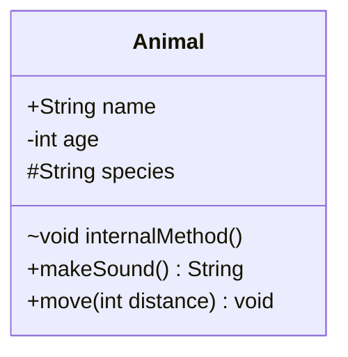
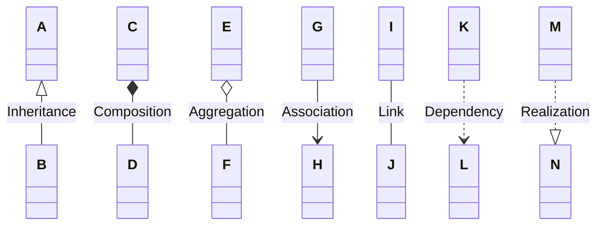
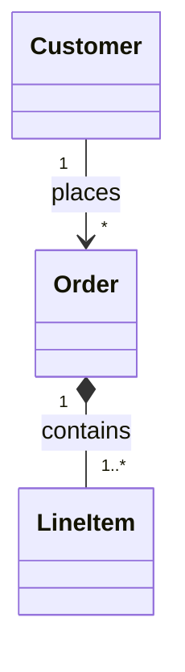
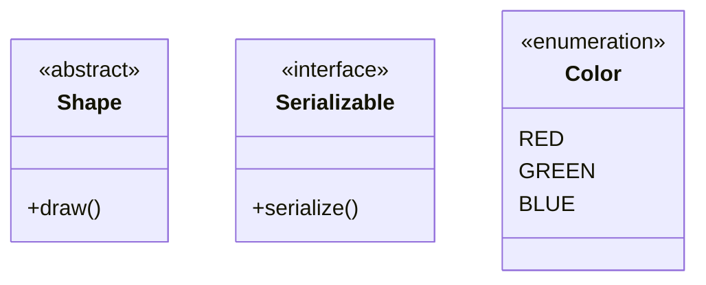
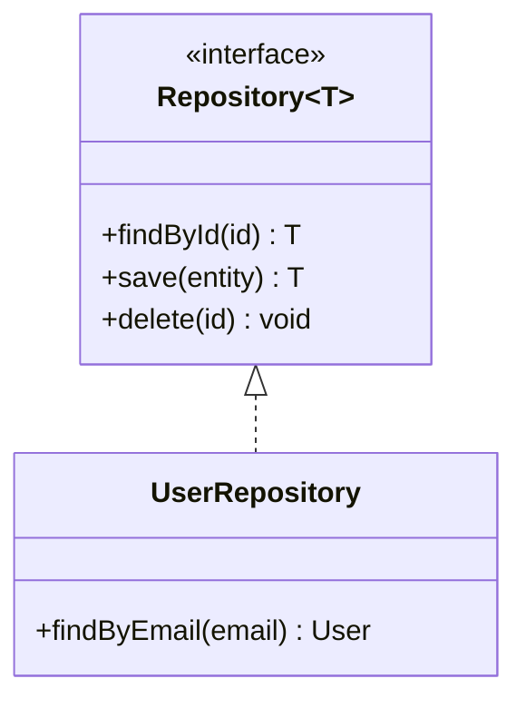

# Class Diagram Syntax

Quick reference for Mermaid class diagrams.

## Class Definition

## Visibility Markers

- `+` Public
- `-` Private
- `#` Protected
- `~` Package/Internal

## Relationships

## Cardinality

- `1` - Exactly one
- `0..1` - Zero or one
- `*` - Many
- `1..*` - One or more
- `n..m` - Range

## Annotations

## Common Pattern: Repository

## Full Documentation

[Mermaid Class Diagram Docs](https://mermaid.js.org/syntax/classDiagram.html)
