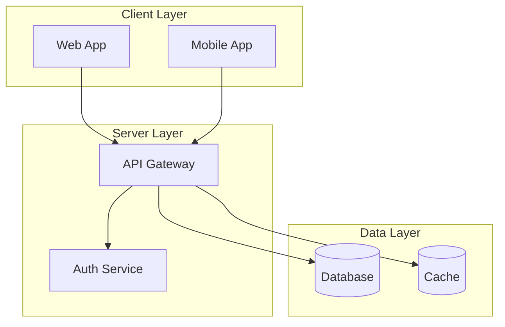
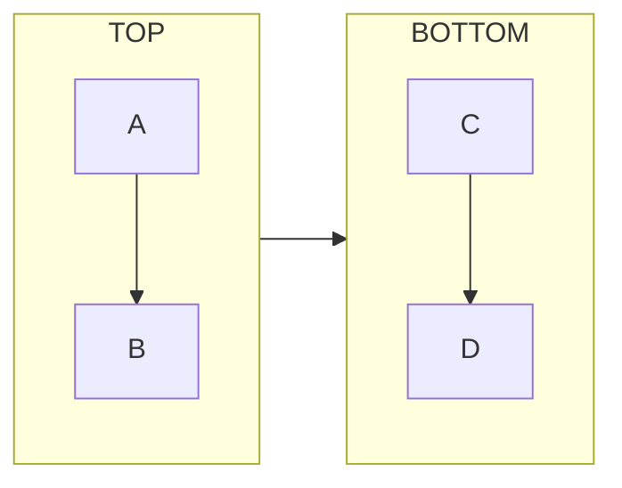
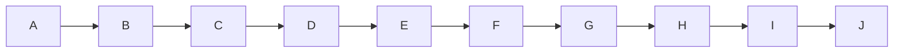
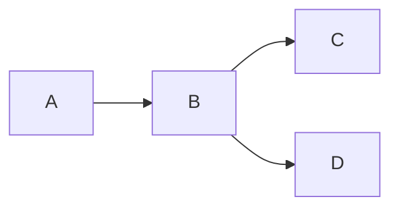
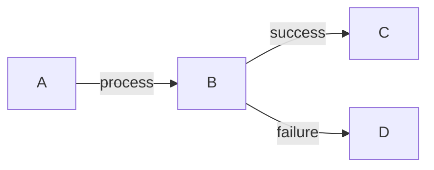
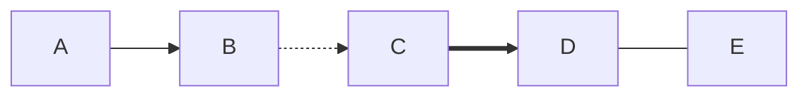

# Common Patterns

Reusable Mermaid diagram patterns and anti-patterns.

## Subgraphs for Grouping



## Direction Changes in Subgraphs



## Multi-Diagram Documents

Use multiple fenced code blocks:

    ## System Overview

    ```mermaid
    flowchart LR
        A --> B --> C
    ```

    ## Sequence Flow

    ```mermaid
    sequenceDiagram
        A->>B: Request
        B-->>A: Response
    ```

## Click Events


## Anti-Patterns

### Too Many Nodes

**Bad:**


**Better:** Use subgraphs or split into multiple diagrams.

### Missing Labels

**Bad:**


**Better:**


### Inconsistent Arrows

**Bad:**


**Better:** Use consistent arrow style unless differences are meaningful.

### Wrong Diagram Type

| Information Type | Recommended Diagram |
|-----------------|---------------------|
| Process flow | Flowchart |
| API interactions | Sequence |
| Object relationships | Class |
| Database schema | ER |
| State transitions | State |
| Project timeline | Gantt |

## Accessibility Tips

- Use high contrast colors
- Add descriptive labels
- Keep diagrams focused
- Provide alt text in markdown
- Test with screen readers

## Performance Tips

- Limit nodes to ~50 per diagram
- Use subgraphs for large diagrams
- Split complex flows into multiple diagrams
- Avoid circular references when possible
