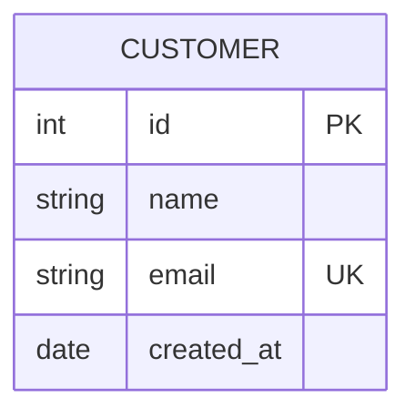
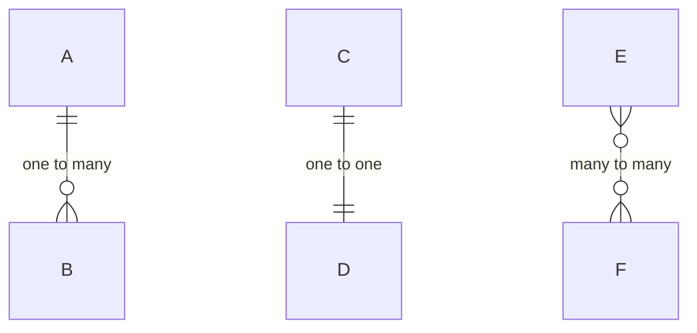
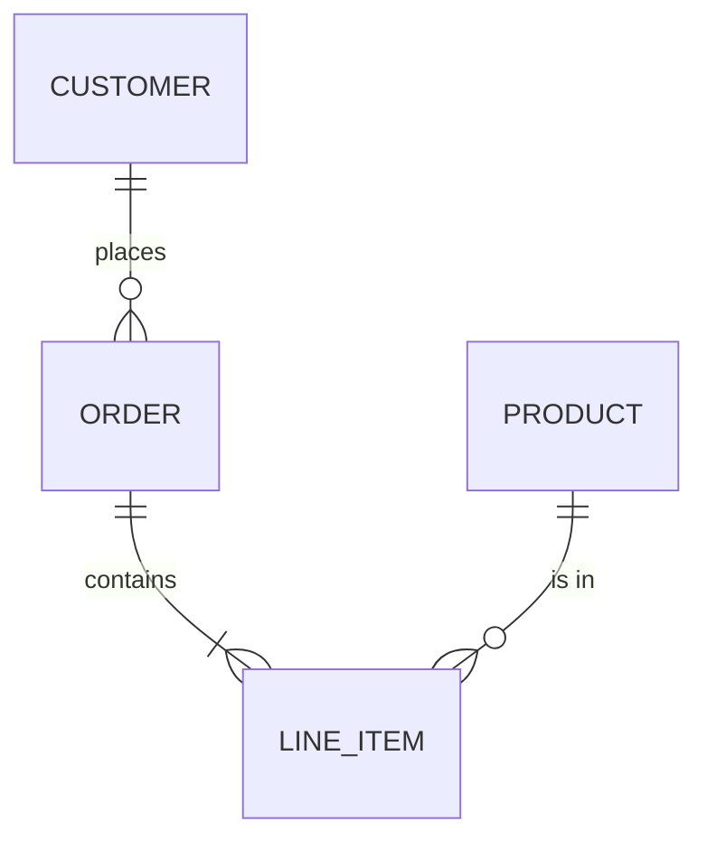
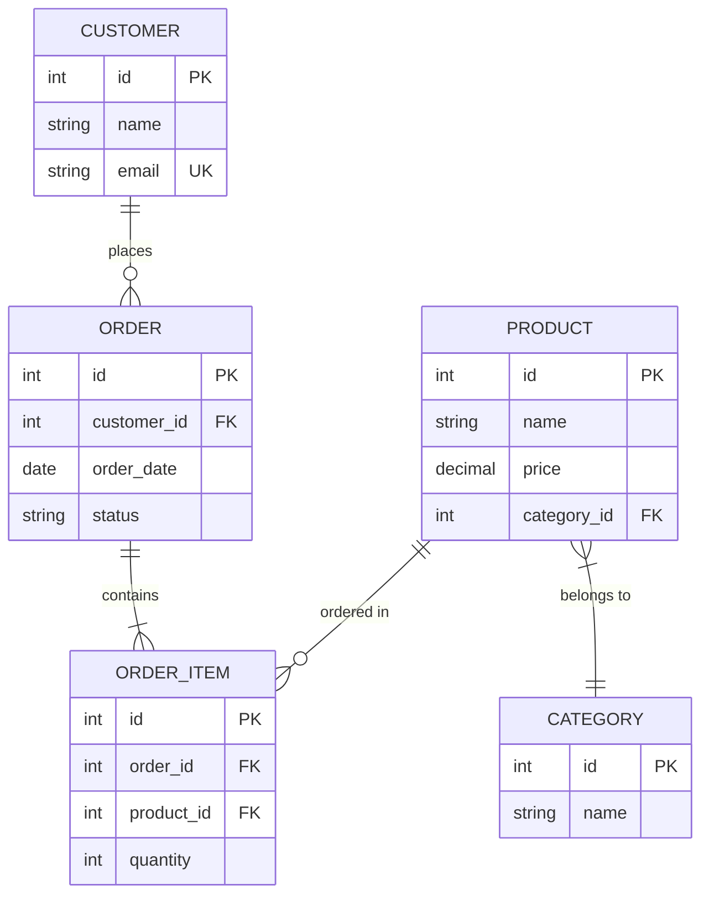

# Entity Relationship Diagram Syntax

Quick reference for Mermaid ER diagrams.

## Entity Definition

## Attribute Types

- `PK` - Primary Key
- `FK` - Foreign Key
- `UK` - Unique Key

## Relationships

## Cardinality Notation

| Symbol | Meaning |
|--------|---------|
| `\|\|` | Exactly one |
| `o\|` | Zero or one |
| `}o` | Zero or many |
| `}\|` | One or many |

## Relationship Labels

## Common Pattern: E-commerce

## Full Documentation

[Mermaid ER Diagram Docs](https://mermaid.js.org/syntax/entityRelationshipDiagram.html)
