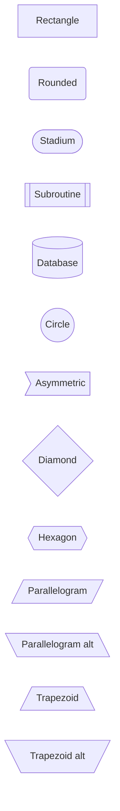
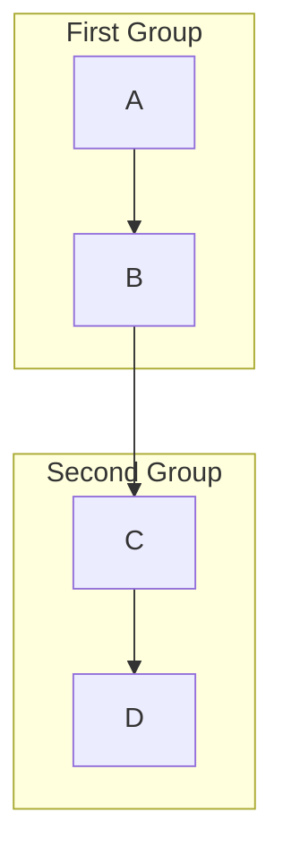
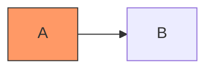
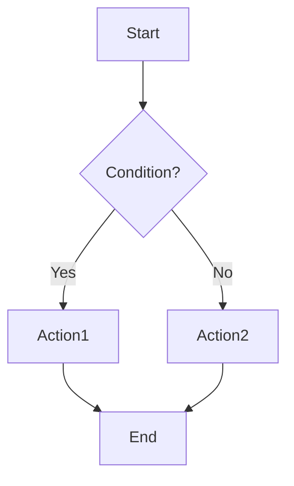
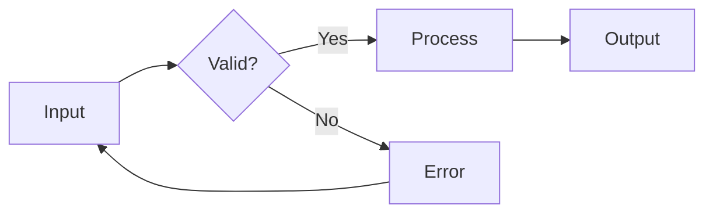

# Flowchart Syntax

Quick reference for Mermaid flowcharts.

## Direction

```mermaid
flowchart TD    %% Top to Down
flowchart LR    %% Left to Right
flowchart BT    %% Bottom to Top
flowchart RL    %% Right to Left
```

## Node Shapes



## Arrow Types

```mermaid
flowchart LR
    A --> B       %% Arrow
    C --- D       %% Line
    E -.-> F      %% Dotted arrow
    G ==> H       %% Thick arrow
    I --text--> J %% Arrow with text
    K -->|text| L %% Arrow with text (alt)
```

## Subgraphs



## Styling



## Common Patterns

### Decision Flow



### Process with Validation



## Full Documentation

[Mermaid Flowchart Docs](https://mermaid.js.org/syntax/flowchart.html)
