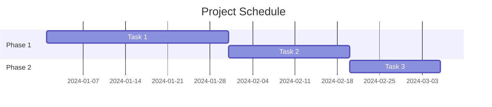
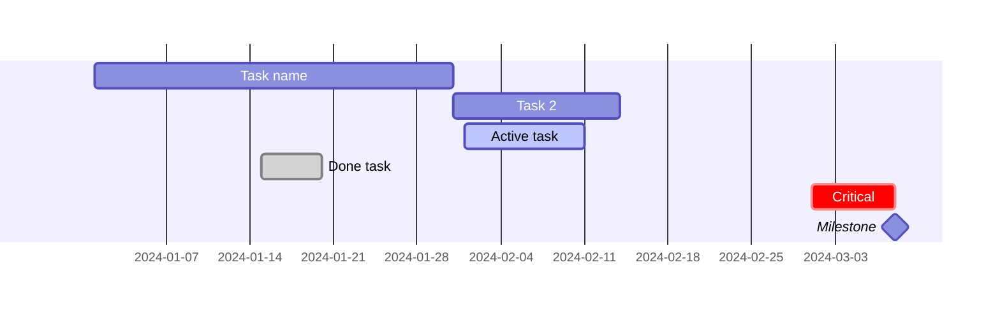
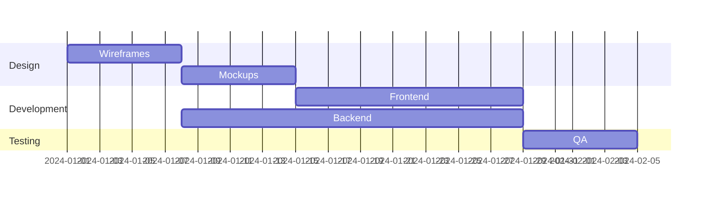
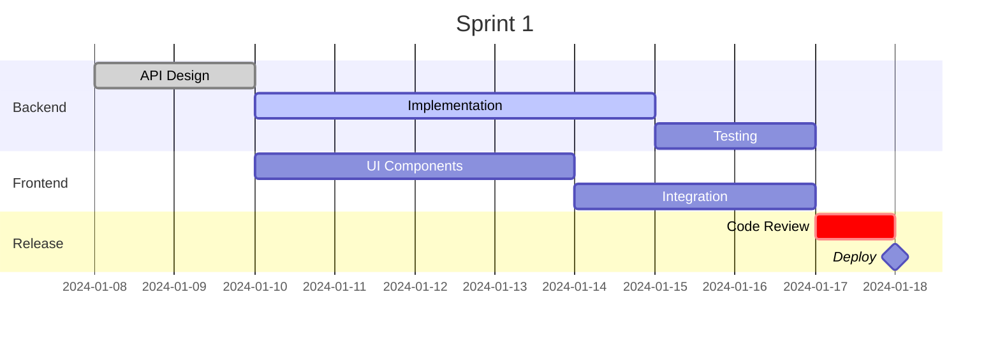

# Gantt Chart Syntax

Quick reference for Mermaid Gantt charts.

## Basic Structure



## Date Formats

```mermaid
gantt
    dateFormat YYYY-MM-DD
    dateFormat DD-MM-YYYY
    dateFormat MM-DD-YYYY
```

## Task Syntax



## Duration Units

- `d` - Days
- `w` - Weeks
- `h` - Hours (for hour format)

## Sections



## Common Pattern: Sprint Planning



## Full Documentation

[Mermaid Gantt Chart Docs](https://mermaid.js.org/syntax/gantt.html)
