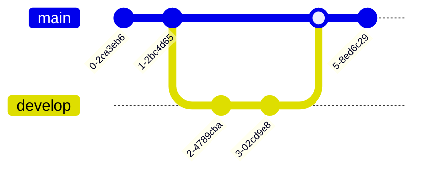

# Git Graph Syntax

Quick reference for Mermaid git graphs.

## Basic Structure

## Commits

## Commit Types

- `NORMAL` - Regular commit (default)
- `REVERSE` - Reverted commit
- `HIGHLIGHT` - Highlighted commit

## Branches

## Common Pattern: Git Flow

## Common Pattern: Hotfix

## Full Documentation

[Mermaid Git Graph Docs](https://mermaid.js.org/syntax/gitgraph.html)
