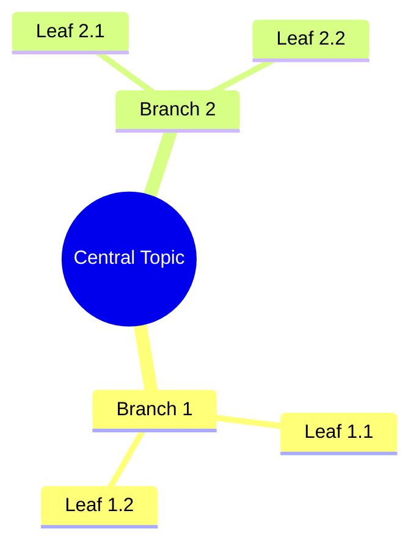
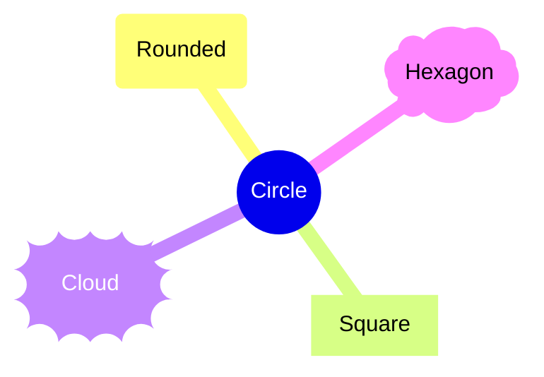
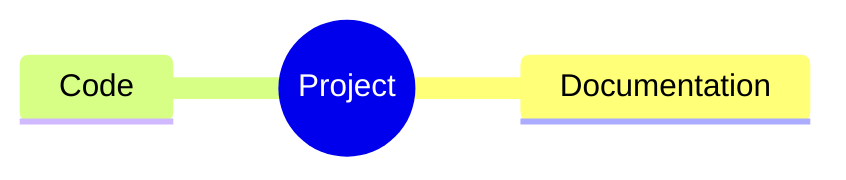
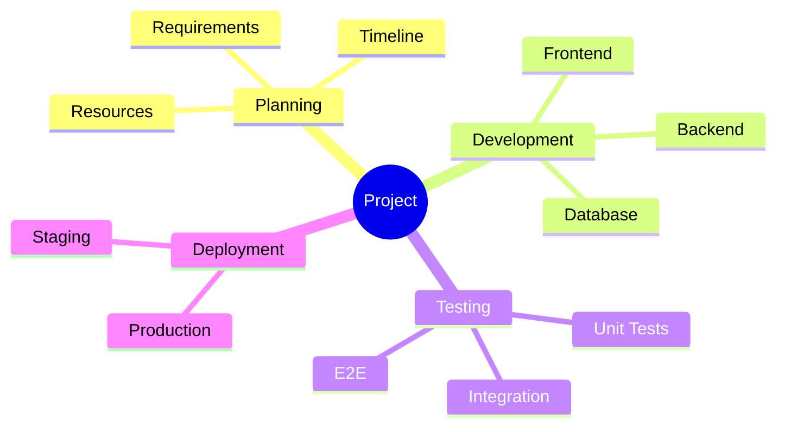
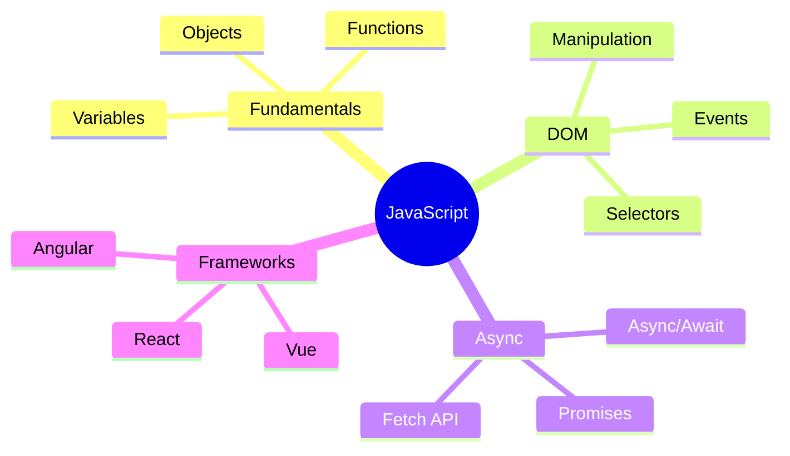

# Mindmap Syntax

Quick reference for Mermaid mindmaps.

## Basic Structure

## Node Shapes

## Icons

## Common Pattern: Project Planning

## Common Pattern: Learning Topics

## Full Documentation

[Mermaid Mindmap Docs](https://mermaid.js.org/syntax/mindmap.html)
