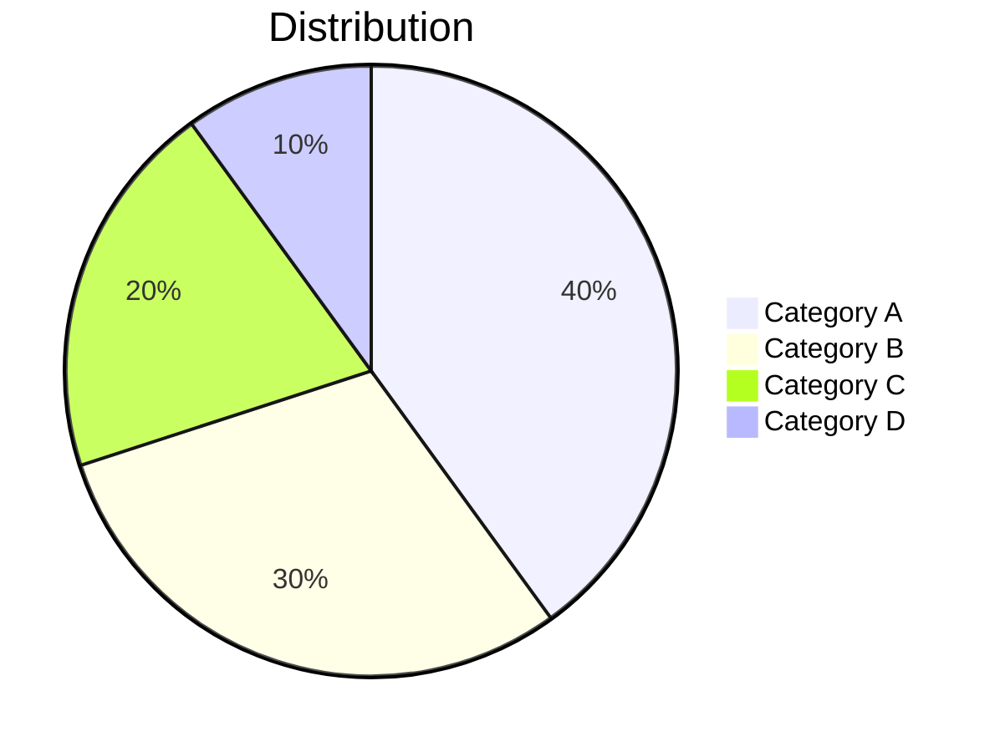
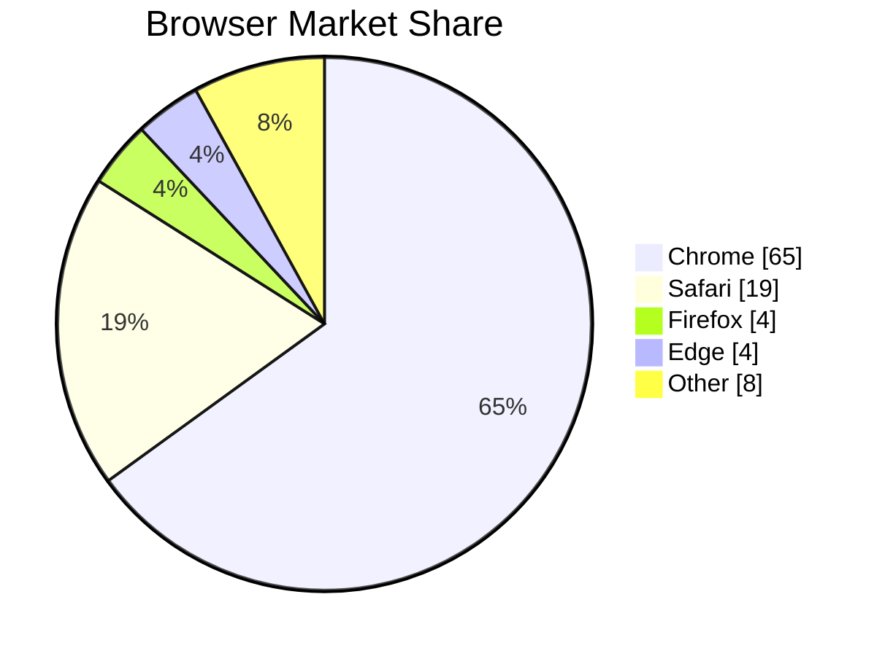
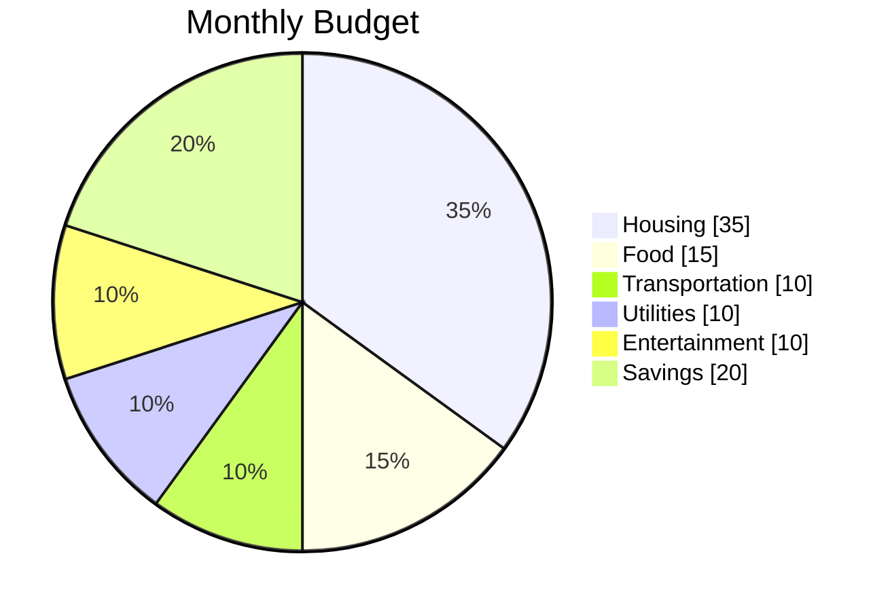
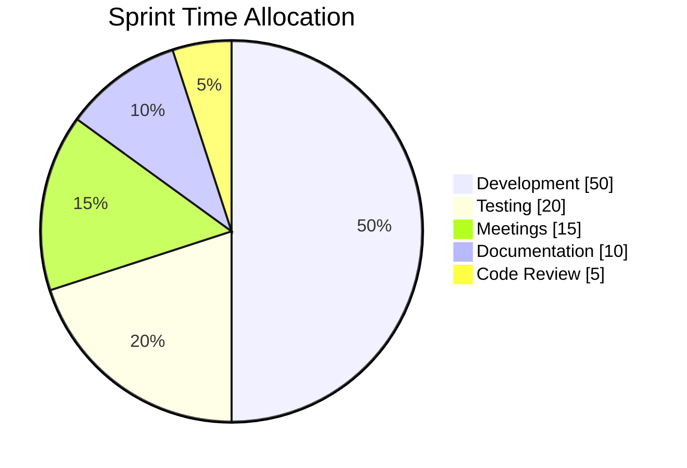

# Pie Chart Syntax

Quick reference for Mermaid pie charts.

## Basic Structure

## With Title

## Options

- `showData` - Display percentages on the chart

## Common Pattern: Budget

## Common Pattern: Time Allocation

## Full Documentation

[Mermaid Pie Chart Docs](https://mermaid.js.org/syntax/pie.html)
