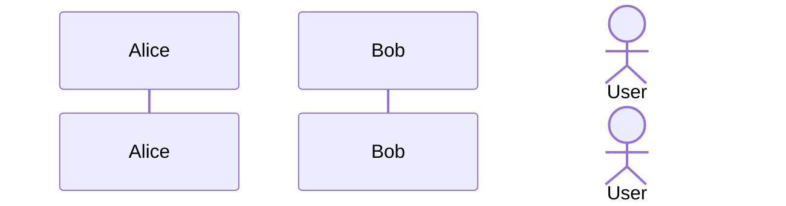
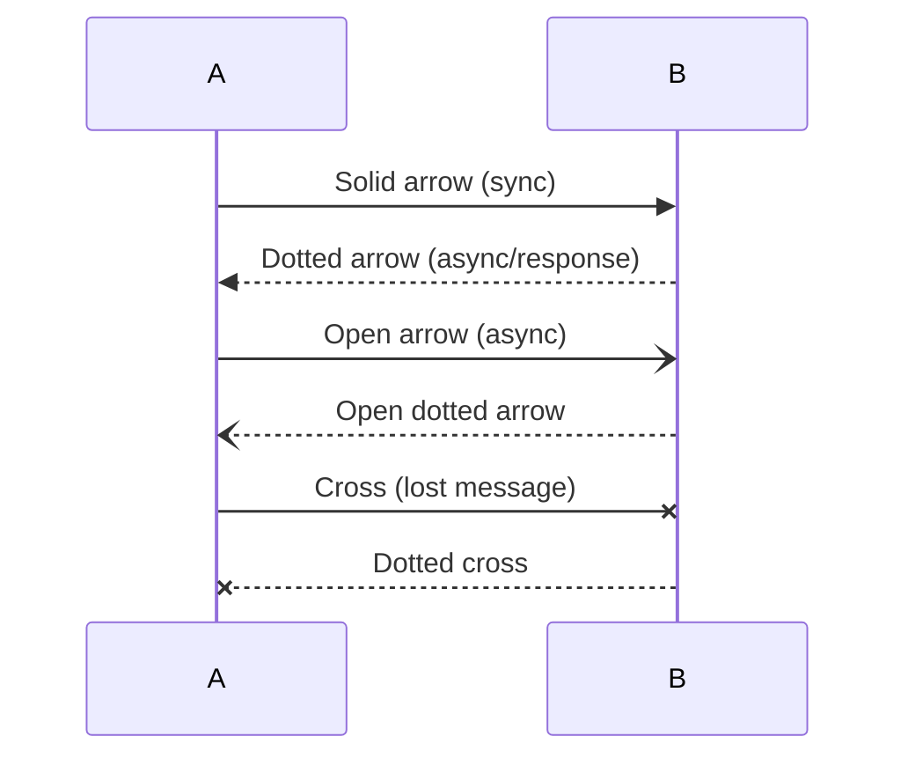
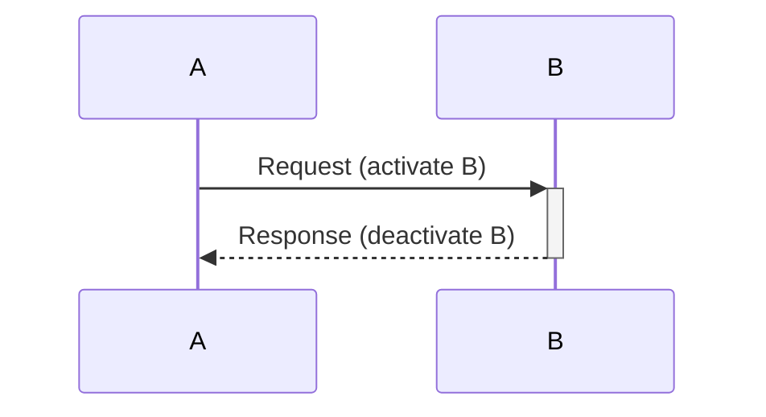
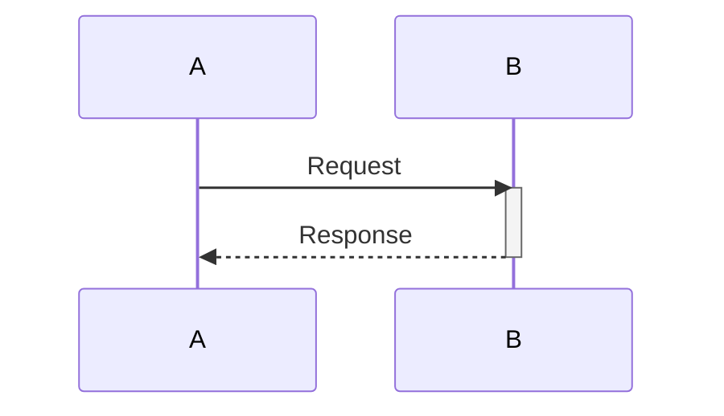
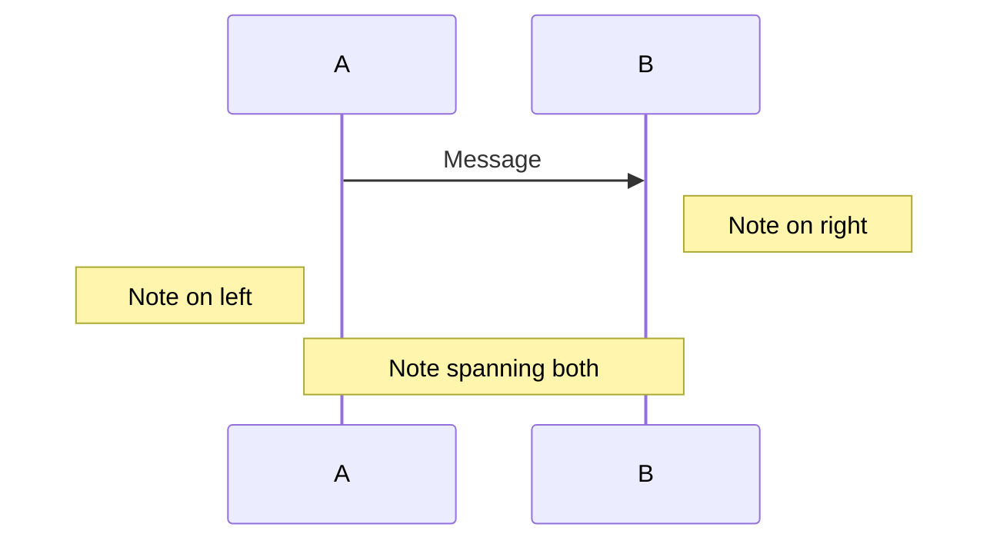
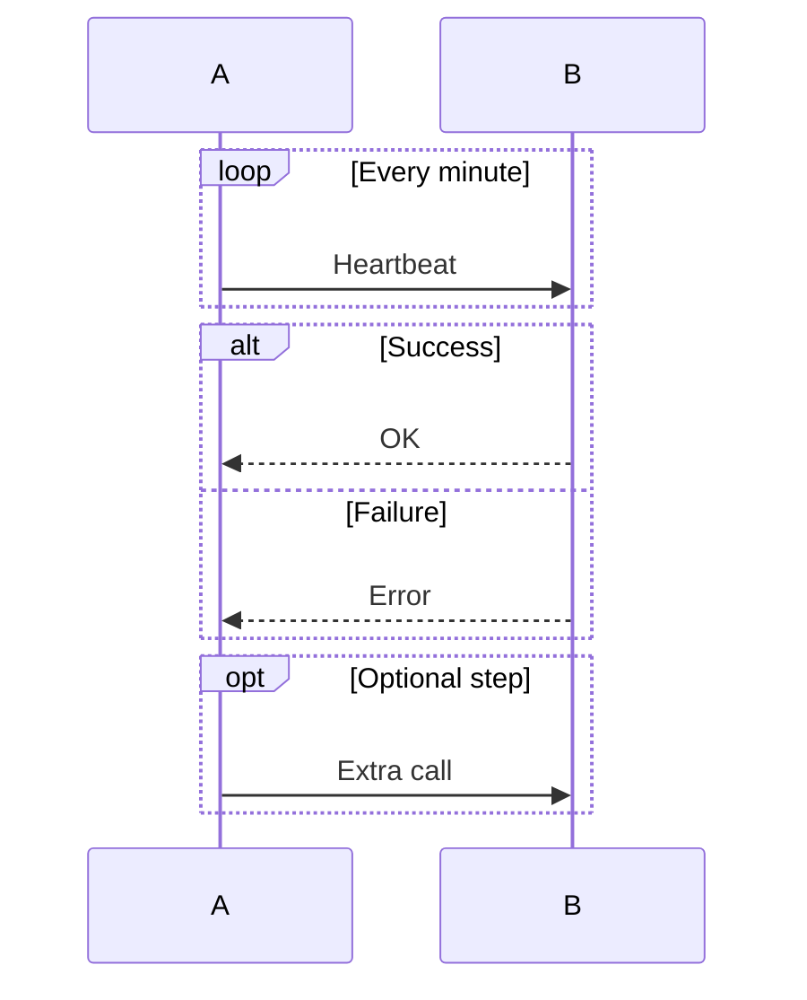
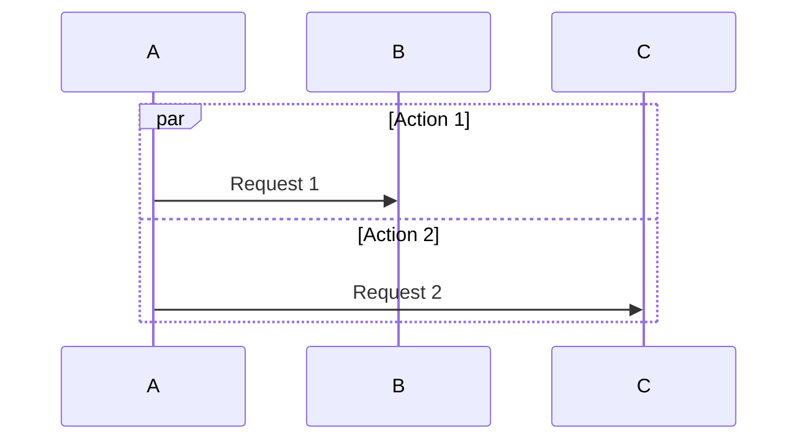
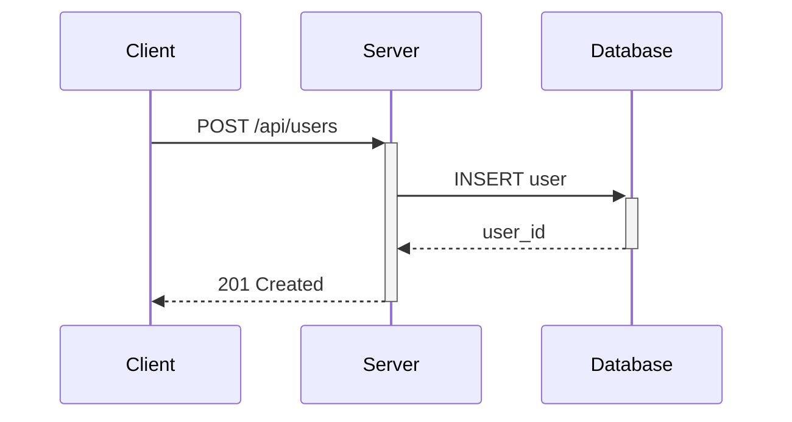

# Sequence Diagram Syntax

Quick reference for Mermaid sequence diagrams.

## Participants

## Message Types

## Activation

Or explicitly:

## Notes

## Loops and Conditionals

## Parallel

## Common Pattern: API Call

## Full Documentation

[Mermaid Sequence Diagram Docs](https://mermaid.js.org/syntax/sequenceDiagram.html)
