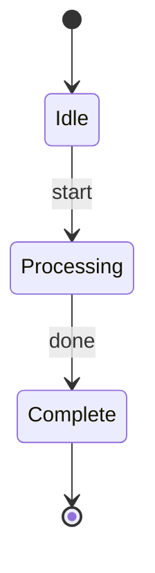
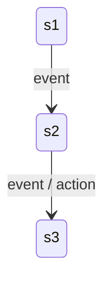
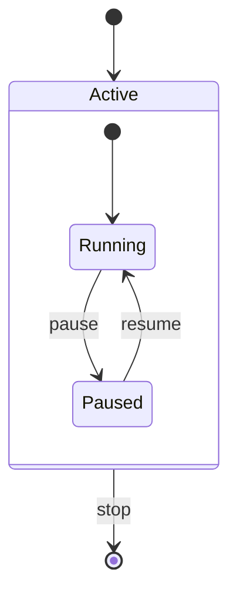
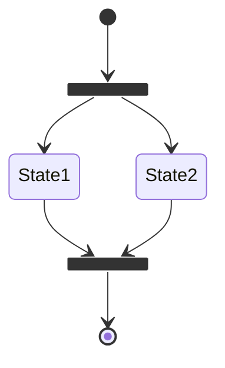
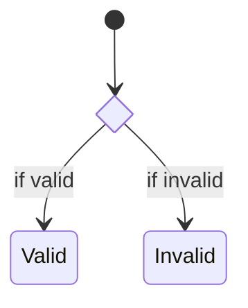
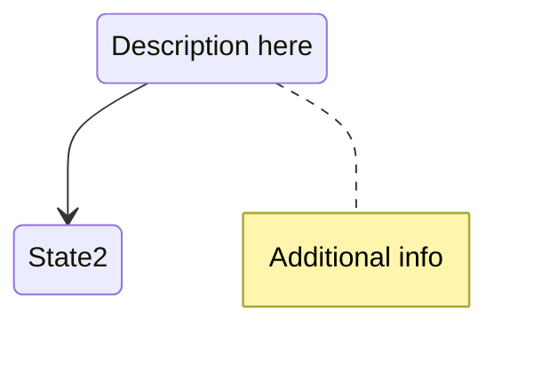
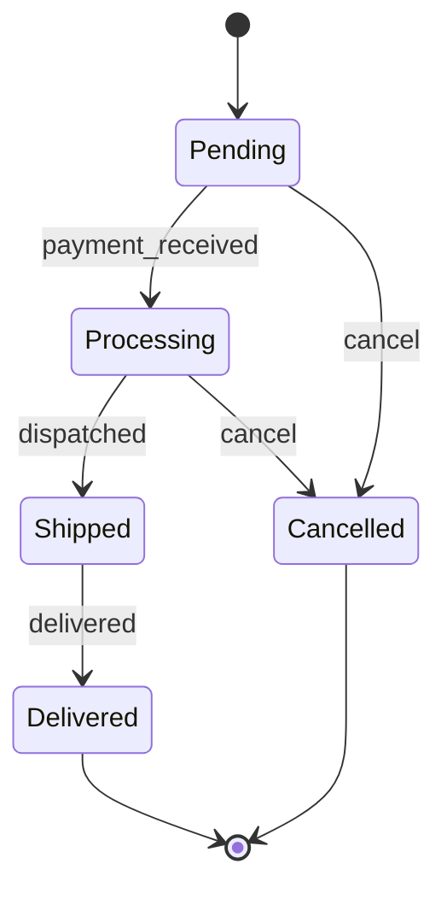

# State Diagram Syntax

Quick reference for Mermaid state diagrams.

## Basic States

## Transitions

## Composite States

## Fork and Join

## Choice

## Notes

## Common Pattern: Order Status

## Full Documentation

[Mermaid State Diagram Docs](https://mermaid.js.org/syntax/stateDiagram.html)
