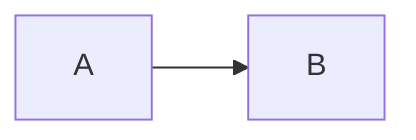
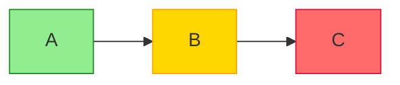
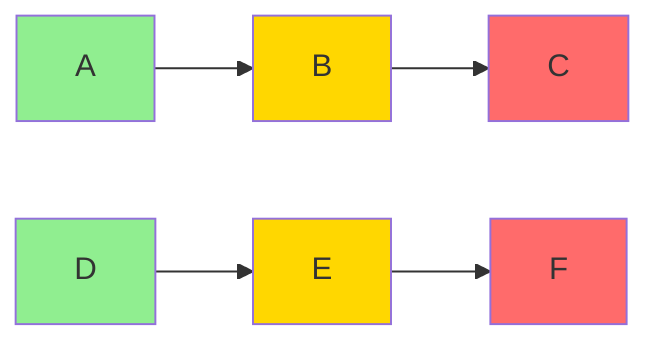
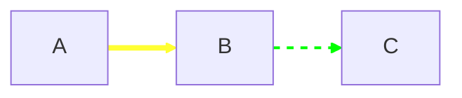
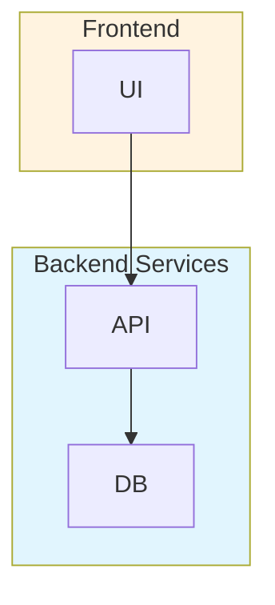

# Styling and Themes

Quick reference for Mermaid styling options.

## Built-in Themes

Available themes:
- `default` - Light theme
- `dark` - Dark theme
- `forest` - Green tones
- `neutral` - Grayscale
- `base` - Minimal styling

## Theme Configuration

## Node Styling with classDef

## Apply Style to Multiple Nodes

## Link Styling

## Subgraph Styling

## Common Theme Variables

| Variable | Description |
|----------|-------------|
| `primaryColor` | Main node fill |
| `primaryTextColor` | Text on primary |
| `primaryBorderColor` | Node borders |
| `lineColor` | Arrow/line color |
| `secondaryColor` | Secondary nodes |
| `tertiaryColor` | Subgraph fills |
| `background` | Diagram background |

## Full Documentation

[Mermaid Theming Docs](https://mermaid.js.org/config/theming.html)
