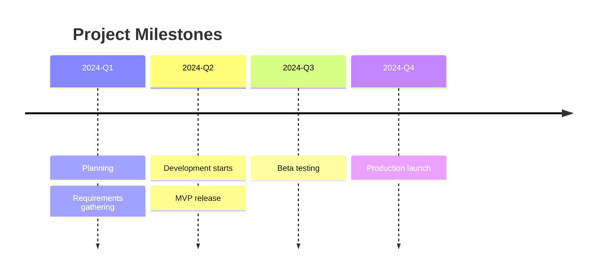
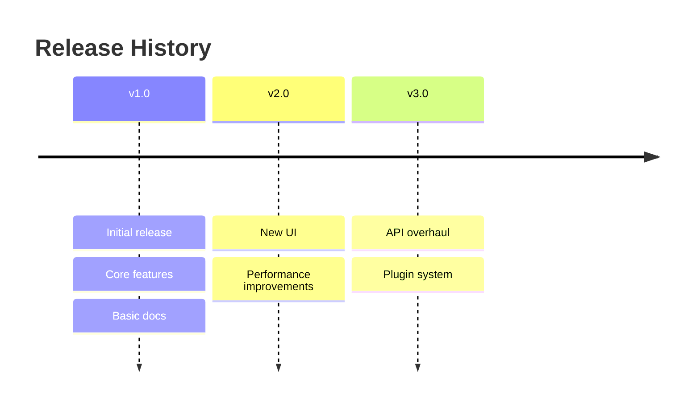
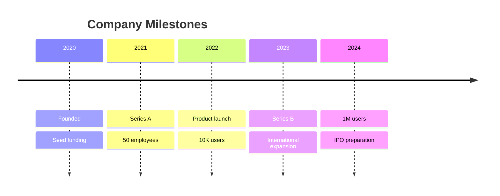
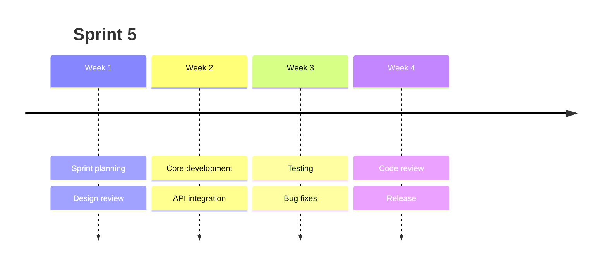

# Timeline Syntax

Quick reference for Mermaid timelines.

## Basic Structure

## Multiple Events Per Period

## Common Pattern: Company History

## Common Pattern: Sprint Timeline

## Full Documentation

[Mermaid Timeline Docs](https://mermaid.js.org/syntax/timeline.html)
