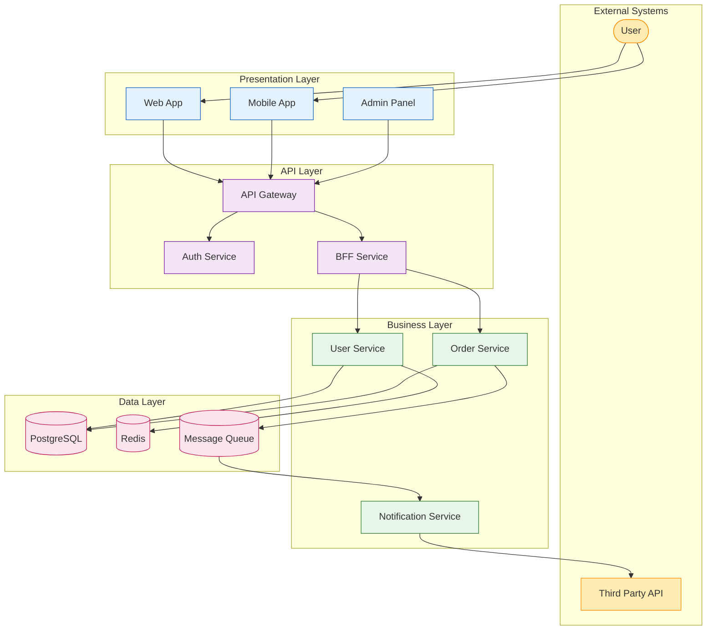
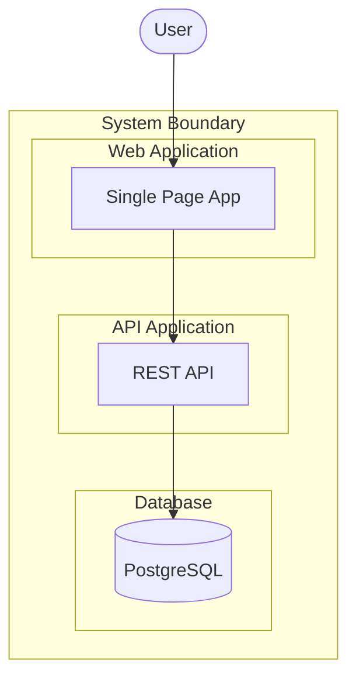

# Architecture Diagram Template

A starter template for system architecture visualization.

## Template

## Customization Points

1. **Layers**: Add or remove architectural layers
2. **Services**: Replace with your actual services
3. **Data stores**: Update with your databases/caches
4. **Connections**: Map actual service dependencies
5. **Colors**: Match your organization's style guide

## Alternative: C4 Model Style

## Tips

- Group related components in subgraphs
- Use consistent colors per layer/type
- Show key data flows, not every connection
- Keep readable: max ~15-20 nodes
