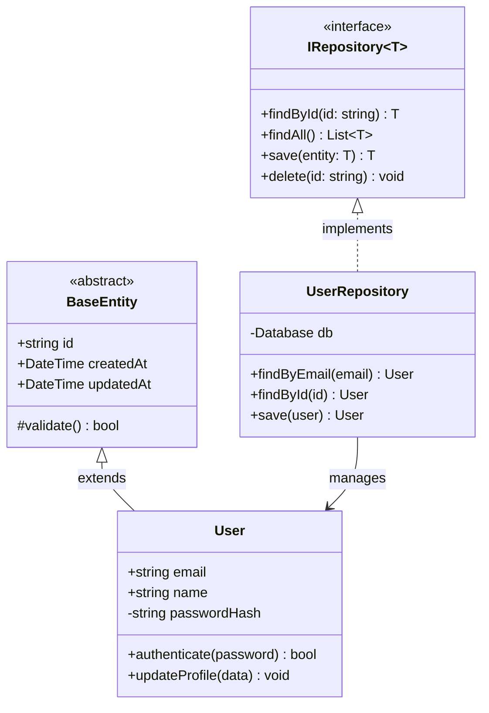
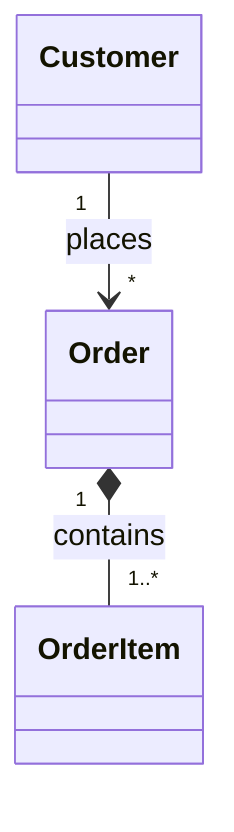

# Class Diagram Template

A starter template for OOP and type relationship diagrams.

## Template

## Customization Points

1. **Classes**: Replace with your domain entities
2. **Methods**: Add your business logic methods
3. **Relationships**: Update inheritance and associations
4. **Annotations**: Use `<<interface>>`, `<<abstract>>`, `<<enumeration>>`

## Visibility Markers

| Symbol | Access Level |
|--------|--------------|
| `+` | Public |
| `-` | Private |
| `#` | Protected |
| `~` | Package |

## Relationship Types

| Arrow | Meaning |
|-------|---------|
| `<\|--` | Inheritance |
| `<\|..` | Implementation |
| `*--` | Composition |
| `o--` | Aggregation |
| `-->` | Association |
| `..>` | Dependency |

## Adding Cardinality

