# ER Diagram Template

A starter template for database schema visualization.

## Template

```mermaid
erDiagram
    %% User management
    USER {
        uuid id PK
        varchar email UK
        varchar name
        varchar password_hash
        timestamp created_at
        timestamp updated_at
    }

    %% Products
    PRODUCT {
        uuid id PK
        varchar name
        text description
        decimal price
        int stock
        uuid category_id FK
    }

    CATEGORY {
        uuid id PK
        varchar name
        uuid parent_id FK
    }

    %% Orders
    ORDER {
        uuid id PK
        uuid user_id FK
        varchar status
        decimal total
        timestamp created_at
    }

    ORDER_ITEM {
        uuid id PK
        uuid order_id FK
        uuid product_id FK
        int quantity
        decimal unit_price
    }

    %% Relationships
    USER ||--o{ ORDER : places
    ORDER ||--|{ ORDER_ITEM : contains
    PRODUCT ||--o{ ORDER_ITEM : "included in"
    CATEGORY ||--o{ PRODUCT : categorizes
    CATEGORY ||--o{ CATEGORY : "parent of"
```

## Customization Points

1. **Entities**: Replace with your database tables
2. **Attributes**: Add your columns with types
3. **Keys**: Mark PK, FK, UK appropriately
4. **Relationships**: Define cardinality

## Cardinality Notation

| Left | Right | Meaning |
|------|-------|---------|
| `\|\|` | `\|\|` | One to one |
| `\|\|` | `o{` | One to zero or many |
| `\|\|` | `\|{` | One to one or many |
| `o\|` | `o{` | Zero or one to zero or many |

## Attribute Types

Common SQL types to use:

- `uuid`, `int`, `bigint` - Identifiers
- `varchar`, `text` - Strings
- `decimal`, `numeric` - Money/precise
- `timestamp`, `date` - Temporal
- `boolean` - Flags
- `jsonb` - Structured data

## Key Markers

- `PK` - Primary Key
- `FK` - Foreign Key
- `UK` - Unique Key

## Tips

- Include only key attributes (not every column)
- Focus on relationships over details
- Use consistent naming (snake_case or camelCase)
- Group related entities visually
