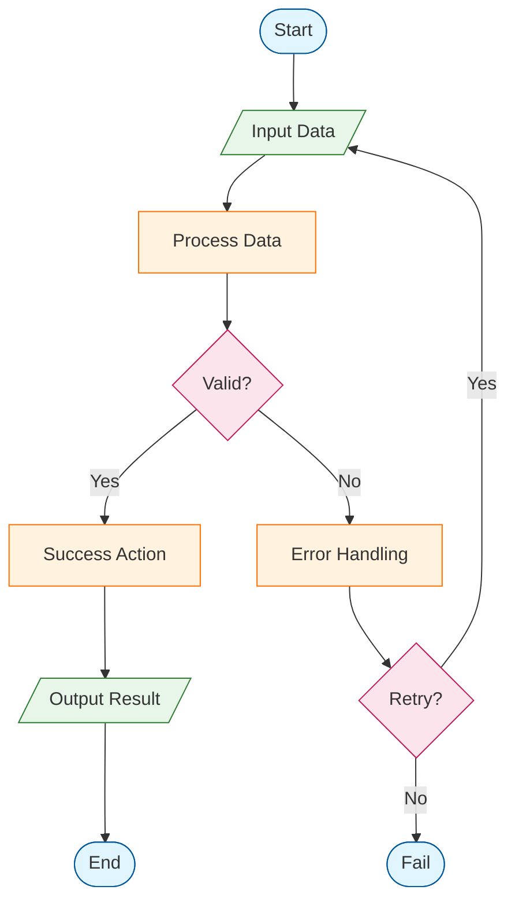

# Flowchart Template

A starter template for process flow diagrams.

## Template

## Customization Points

1. **Direction**: Change `TD` to `LR` for left-to-right flow
2. **Nodes**: Replace placeholder text with your process steps
3. **Decisions**: Add or remove decision points as needed
4. **Styling**: Modify `classDef` colors to match your theme

## Node Shape Reference

| Shape | Syntax | Use For |
|-------|--------|---------|
| Rectangle | `[text]` | Actions, steps |
| Rounded | `(text)` | Start/End |
| Stadium | `([text])` | Terminals |
| Diamond | `{text}` | Decisions |
| Parallelogram | `[/text/]` | Input/Output |
| Database | `[(text)]` | Data storage |
