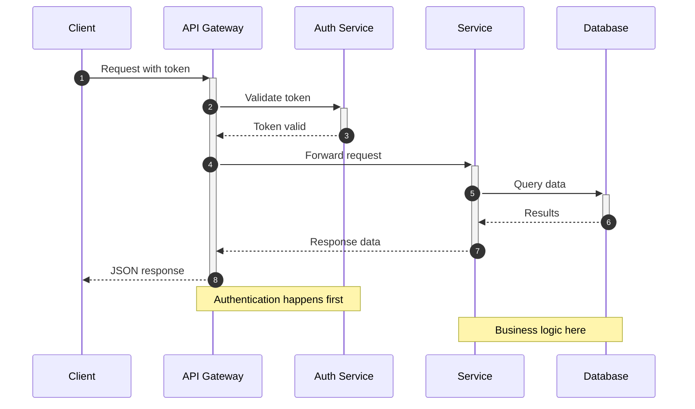
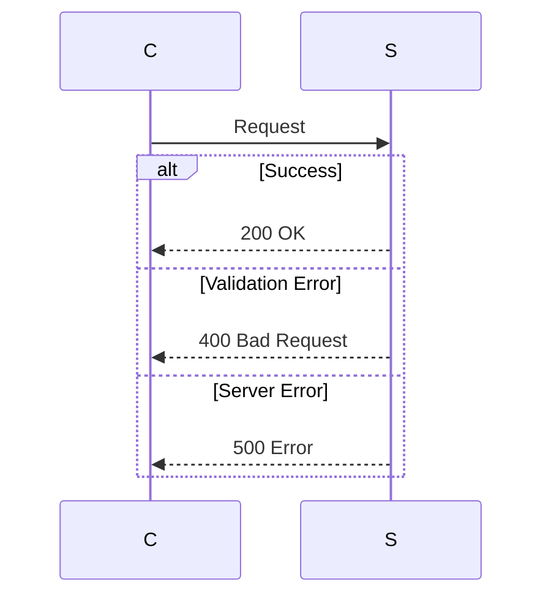
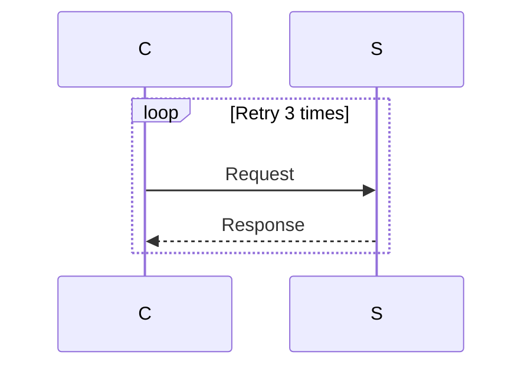

# Sequence Diagram Template

A starter template for API/service interaction diagrams.

## Template

## Customization Points

1. **Participants**: Replace with your system components
2. **Messages**: Update with your API calls
3. **Activation**: Use `+`/`-` to show processing time
4. **Notes**: Add context where helpful

## Message Types

| Arrow | Meaning |
|-------|---------|
| `->>` | Synchronous request |
| `-->>` | Response/async |
| `-)` | Async message |
| `-x` | Lost message |

## Adding Error Handling

## Adding Loops

