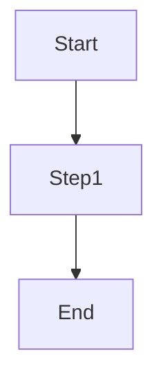
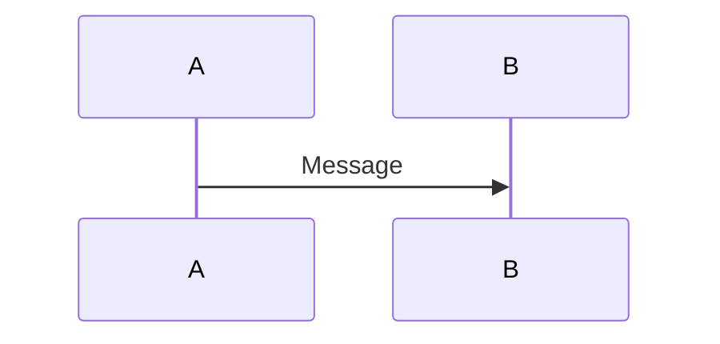
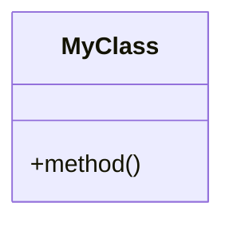
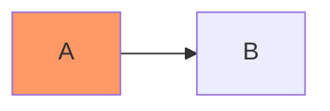

# Create Diagram Workflow

Step-by-step guide for creating new Mermaid diagrams.

## Step 1: Choose Diagram Type

Select based on what you're visualizing:

| Information Type | Diagram Type |
|-----------------|--------------|
| Process flow, decisions | Flowchart |
| System interactions | Sequence |
| Object/class relationships | Class |
| State transitions | State |
| Database schema | ER |
| Project timeline | Gantt |
| Proportions | Pie |
| Ideas/hierarchy | Mindmap |

## Step 2: Start with a Template

Copy the appropriate template from [templates/](../templates/):

- [flowchart.md](../templates/flowchart.md)
- [sequence-diagram.md](../templates/sequence-diagram.md)
- [class-diagram.md](../templates/class-diagram.md)
- [architecture-diagram.md](../templates/architecture-diagram.md)
- [er-diagram.md](../templates/er-diagram.md)

## Step 3: Define Structure

Start with the basic skeleton:

**Flowchart:**



**Sequence:**



**Class:**



## Step 4: Add Content Incrementally

1. Add nodes/participants one section at a time
2. Validate after each major addition
3. Keep the diagram renderable at each step

## Step 5: Add Relationships

Connect your elements:

- Flowchart: `-->`, `-.->`, `==>`
- Sequence: `->>`, `-->>`, `-)>`
- Class: `<|--`, `*--`, `-->`
- ER: `||--o{`, `}|--|{`

## Step 6: Apply Styling (Optional)

Add visual enhancements:



## Step 7: Validate

Run validation:

```bash
${SKILL_DIR}/scripts/validate-mermaid.sh your-diagram.md
```

Or paste at [mermaid.live](https://mermaid.live)

## Step 8: Integrate

Embed in markdown:

    ```mermaid
    flowchart LR
        A --> B
    ```

## Checklist

- [ ] Correct diagram type selected
- [ ] All elements have descriptive labels
- [ ] Relationships are clear
- [ ] Syntax validates without errors
- [ ] Diagram is readable (not too crowded)
- [ ] Styling is consistent
