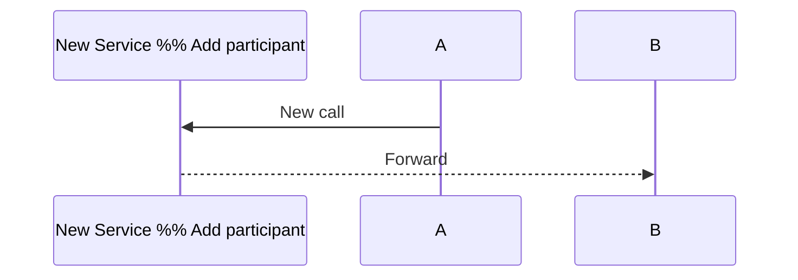
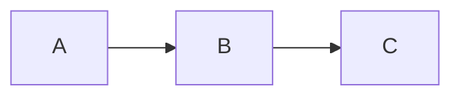
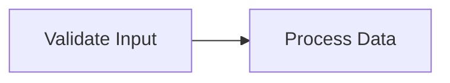
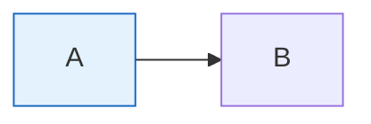

# Edit Diagram Workflow

Step-by-step guide for modifying existing Mermaid diagrams.

## Step 1: Read the Existing Diagram

First, understand what you're working with:

1. Read the file containing the diagram
2. Identify the diagram type (flowchart, sequence, class, etc.)
3. Note the existing structure and styling

## Step 2: Identify Changes

Common modification types:

- **Add nodes/participants** - Extend the diagram
- **Remove nodes** - Simplify or update
- **Modify connections** - Change relationships
- **Update labels** - Improve clarity
- **Restyle** - Change appearance

## Step 3: Make Changes

### Adding Nodes

**Flowchart:**

```mermaid
flowchart LR
    A --> B --> C
    B --> NewNode --> C  %% Add new node
```

**Sequence:**



### Removing Nodes

1. Remove the node definition
2. Remove all connections to/from it
3. Reconnect remaining nodes if needed

### Modifying Connections

**Before:**



**After:**

```mermaid
flowchart LR
    A --> B
    A --> C  %% Direct connection
    B --> C
```

### Updating Labels

**Before:**


**After:**



### Changing Styling

**Add or modify classDef:**



## Step 4: Validate Changes

After each significant change:

```bash
${SKILL_DIR}/scripts/validate-mermaid.sh diagram.md
```

## Step 5: Review

- [ ] Original intent preserved
- [ ] New elements properly connected
- [ ] No orphaned nodes
- [ ] Labels still accurate
- [ ] Styling consistent
- [ ] Diagram validates

## Common Issues

### Orphaned Nodes

**Problem:** Node exists but isn't connected

**Solution:** Either connect it or remove it

### Broken References

**Problem:** Arrow points to non-existent node

**Solution:** Check node IDs match exactly

### Syntax Errors After Edit

**Problem:** Diagram won't render

**Solution:**

1. Check for missing quotes around special characters
2. Verify arrow syntax is correct
3. Ensure subgraphs are properly closed

## Refactoring Large Diagrams

If the diagram is too complex:

1. **Split into subgraphs** for visual grouping
2. **Extract to multiple diagrams** for different views
3. **Simplify** by removing implementation details
