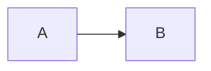
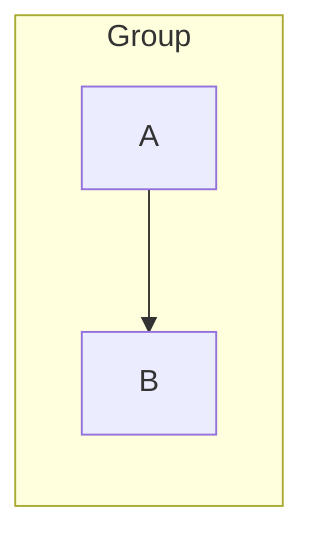
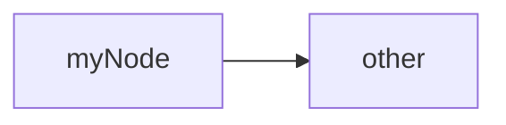
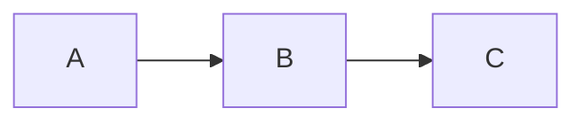

# Validate Diagram Workflow

Approaches for validating Mermaid diagram syntax.

## Method 1: mermaid-cli (Recommended)

Use the validation script:

```bash
${SKILL_DIR}/scripts/validate-mermaid.sh diagram.md
```

**Success output:**

```json
{"valid":true,"message":"Diagram syntax is valid"}
```

**Error output:**

```json
{"error":true,"message":"Syntax error: ...","code":"SYNTAX_ERROR"}
```

### Direct npx Usage

```bash
# Validate .mmd file
npx -y @mermaid-js/mermaid-cli -i diagram.mmd -o /dev/null

# Validate inline
echo 'flowchart LR
    A --> B' | npx -y @mermaid-js/mermaid-cli -i - -o /dev/null
```

## Method 2: Mermaid Live Editor

1. Go to [mermaid.live](https://mermaid.live)
2. Paste your diagram code
3. Check for errors in the preview panel

**Pros:**

- No installation required
- Immediate visual feedback
- Shareable links

## Method 3: VS Code Extension

Install "Mermaid Preview" or "Markdown Preview Mermaid Support":

1. Open markdown file with mermaid code block
2. Open preview (Cmd+Shift+V / Ctrl+Shift+V)
3. Errors shown in preview pane

## Method 4: GitHub/GitLab Preview

1. Commit file with mermaid code block
2. View in repository UI
3. Rendering errors indicate syntax issues

## Common Syntax Errors

### Missing Quotes

**Error:**

```
flowchart LR
    A[Click (here)] --> B
```

**Fix:**


### Invalid Arrow

**Error:**

```
flowchart LR
    A -> B
```

**Fix:**



### Unclosed Subgraph

**Error:**

```
flowchart LR
    subgraph Group
        A --> B
```

**Fix:**



### Invalid Node ID

**Error:**

```
flowchart LR
    my-node --> other
```

**Fix:**



Node IDs cannot contain hyphens.

### Missing Diagram Type

**Error:**

```
    A --> B --> C
```

**Fix:**



## Validation Checklist

- [ ] Diagram type declared (flowchart, sequenceDiagram, etc.)
- [ ] All node IDs are valid (alphanumeric, no hyphens)
- [ ] Special characters in labels are quoted
- [ ] Subgraphs are properly closed with `end`
- [ ] Arrow syntax is correct for diagram type
- [ ] All referenced nodes exist

## Troubleshooting

### "Unknown diagram type"

Check the first line declares a valid type:

- `flowchart` or `graph`
- `sequenceDiagram`
- `classDiagram`
- `stateDiagram-v2`
- `erDiagram`
- `gantt`
- `pie`
- `mindmap`
- `timeline`
- `gitGraph`

### "Parse error"

Usually indicates:

1. Typo in keyword
2. Missing or extra characters
3. Invalid syntax for diagram type

Try removing the last change and re-adding carefully.
