# Executing Plan

Execute an approved `plan.md` produced by the `planning` skill. A dedicated git worktree is created upfront, tasks are implemented **one at a time** with a code-reviewer pass after each commit, progress is tracked in `plan.md`, accumulated review warnings are surfaced to the user at the end, and a final holistic review runs before the PR is created.

Do **NOT** write implementation code directly — all code work is delegated to subagents.

## Quick Start

1. Have an approved `docs/features/<NNN>-<slug>/plan.md` ready
2. Invoke: `/executing-plan docs/features/<NNN>-<slug>`

## Process Flow

```mermaid
flowchart TD
    A([Start]) --> W[Create git worktree<br/>Skill using-git-worktrees]
    W --> B[Read plan.md]
    B --> C[Critical review<br/>scan for blockers]
    C --> D{Blockers?}
    D -- Yes --> E[Raise via AskUserQuestion<br/>one question per blocker type]
    E --> F{Resolved?}
    F -- No --> G([Abort])
    F -- Yes --> H[Initialize TodoWrite<br/>one entry per task]
    D -- No --> H
    H --> TASK

    subgraph TASK[Execute Task — repeat for every task]
        direction TD
        T0[Per-task checklist<br/>see below] --> T1[Determine agent]
        T1 --> T2[Spawn ONE implementation agent<br/>full task block + feature path]
        T2 --> T3[Wait for commit]
        T3 --> T4[Spawn code-reviewer<br/>writes full report to feature/reviews/task-NNN.md]
        T4 --> T5{VERDICT FAIL?}
        T5 -- Yes --> T6[Respawn implementation agent<br/>with Critical findings]
        T6 --> T7[Edit plan.md: flip - to x with SHA]
        T5 -- No --> T7
        T7 --> T8[Mark TodoWrite complete]
    end

    TASK --> Q{More tasks?}
    Q -- Yes --> TASK
    Q -- No --> R[Final holistic code-reviewer]
    R --> AGG[Aggregate Warnings from all reviews/*.md]
    AGG --> AQU[AskUserQuestion: triage top warnings]
    AQU --> ACT{Fix any?}
    ACT -- Yes --> FIX[Spawn implementation agent per accepted item]
    ACT -- No --> WW[Write review-warnings.md]
    FIX --> WW
    WW --> S[Skill git-commits + gh pr create]
    S --> CL{Clean up worktree?}
    CL -- Yes --> RM[Skill using-git-worktrees<br/>remove worktree]
    CL -- No --> Z
    RM --> Z([Done])
```

## Per-Task Checklist (mandatory — tick through every iteration)

Before spawning the implementation agent, assert each item out loud in your status update:

- [ ] **Single task only.** The agent prompt contains exactly one `### Task NNN:` block. Never bundle, even when tasks "follow the same pattern" — bundling forfeits per-task traceability, plan.md progress accuracy, and per-task review reports.
- [ ] **Right agent.** Selected per the [Agent Selection](#agent-selection) table. Reasoned from task content, not file extension.
- [ ] **Full task block + feature path passed verbatim.**

After the implementation agent commits:

- [ ] **Code-reviewer ran.** Skip only for `technical-writer` tasks. No exceptions for "this task is small" or "the same pattern was reviewed last time".
- [ ] **Verdict acted on.** `VERDICT: FAIL` → respawn implementation agent with Critical findings. `VERDICT: PASS` → continue. Warnings/Suggestions are NOT dismissed — they remain in `<feature>/reviews/task-NNN.md` for the end-of-run aggregation step.
- [ ] **plan.md updated.** Flip `- [ ]` to `- [x] → <commit-sha>` for the completed task using `Edit`. This makes progress survive auto-compaction.
- [ ] **TodoWrite marked complete.**

## Compaction Recovery

If at the start of an iteration you observe a `compact_boundary` system record or a "session continued" summary marker, the skill instructions and conversation history have both been condensed. Before doing anything else:

1. Re-read this SKILL.md in full
2. Re-read the feature's `plan.md`
3. Find the first `- [ ]` in plan.md — that is the next task. Do not derive next-task from compacted memory alone.

## Critical Plan Review (before starting)

Scan for these blockers before initialising TodoWrite:

- `[AMBIGUOUS: ...]` markers left by the task-decomposer
- Placeholder `<test-command>` or `path/to/` not yet filled in
- Files or modules referenced that do not exist yet
- Tasks with more than 10 steps (ask whether to split)
- Missing tech stack details (test runner unspecified, language version unknown)

Present all blockers in a single `AskUserQuestion` — one question per blocker type.

## Agent Selection

Read the task title, description, steps, and file list — then reason about what the task is fundamentally about:

| Agent | Use when |
|-------|----------|
| `python-task-agent` | Writing or modifying Python source code |
| `coding-task-agent` | Writing or modifying source code in any other language |
| `technical-writer` | Documentation, READMEs, changelogs only — no executable code |
| `code-debugger` | Diagnosing and fixing a broken or failing implementation |

Do not reduce this to file extension matching. A `.md` update involving technical decisions belongs to `coding-task-agent`. A Python script generating documentation output may suit `technical-writer`.

`technical-writer` tasks skip the code-reviewer step and the `<feature>/reviews/` write.

## Spawning the Code Reviewer

When invoking the `code-reviewer` agent, pass:

- The **full path** to the feature directory (e.g. `/abs/path/docs/features/001-oauth`)
- The **task identifier** (e.g. `Task 007`)
- The **task title**

The reviewer writes its full report to `<feature>/reviews/task-NNN.md` (creating the directory if needed) and returns only:

- `VERDICT: PASS` or `VERDICT: FAIL`
- Counts: `Critical: N`, `Warnings: N`, `Suggestions: N`
- One-line summary
- The path to the full report

The orchestrator only needs the verdict and counts to decide whether to respawn — full report contents stay on disk to keep orchestrator context bounded.

## End-of-Run Warning Triage

After the final holistic review:

1. Read every `<feature>/reviews/task-NNN.md` plus the final review report
2. Aggregate all `Warnings` across reports — deduplicate by `file:line` + issue, sort by file then severity
3. Surface the top warnings to the user via `AskUserQuestion`. For each, offer: *Fix now* / *Defer to follow-up* / *Dismiss with reason*. If there are too many to ask one-by-one, group by file or theme
4. For *Fix now* items, spawn an implementation agent per fix (or one agent for tightly related fixes) and re-run code-reviewer
5. Write the consolidated outcome to `<feature>/review-warnings.md`:
   - Items fixed (with commit SHAs)
   - Items deferred (with the user's reason)
   - Items dismissed (with the user's reason)

This step replaces the silent "noted but not blocking" behaviour that previously deferred a fix-storm to the very end of the run.

## Remember

- **ALWAYS invoke `Skill(using-git-worktrees)` as the very first action — before reading plan.md, before any other step. The current git branch is irrelevant. Never reason your way out of this step.**
- Never write implementation code yourself — delegate all code work to subagents.
- When spawning implementation agents: pass the **full task block verbatim** + absolute path to the feature directory + any blocker resolutions.
- If an agent returns without a commit (nothing changed), report it to the user and move on — do not block. Still flip plan.md if the task was a no-op (note `→ no-op` instead of a SHA).
- If the plan has no `### Task NNN:` blocks, stop and inform the user the plan is empty or malformed.
- Keep the user informed with brief status updates between tasks ("Executing Task 003: implement parse_token…").

## When to Stop and Ask for Help

Stop and use `AskUserQuestion` if:

- You hit a blocker (missing dependency, tests fail, instruction unclear)
- The plan has critical gaps preventing you from starting
- You don't understand an instruction
- Verification fails repeatedly
- The end-of-run warning aggregation surfaces more than ~10 items (ask the user how to group them before triaging)
