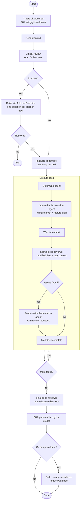

# Executing Plan

Execute an approved `plan.md` produced by the `planning` skill. A dedicated git worktree is created upfront, tasks are implemented one at a time with a code-reviewer pass after each commit, and a final holistic review runs before the PR is created.

Do **NOT** write implementation code directly — all code work is delegated to subagents.

## Quick Start

1. Have an approved `docs/features/<NNN>-<slug>/plan.md` ready
2. Invoke: `/executing-plan docs/features/<NNN>-<slug>`

## Process Flow

**Critical review — scan for these blockers before starting:**

- `[AMBIGUOUS: ...]` markers left by the task-decomposer
- Placeholder `<test-command>` or `path/to/` not yet filled in
- Files or modules referenced that do not exist yet
- Tasks with more than 10 steps (ask whether to split)
- Missing tech stack details (test runner unspecified, language version unknown)

Present all blockers in a single `AskUserQuestion` — one question per blocker type.

## Agent Selection

Read the task title, description, steps, and file list — then reason about what the task is fundamentally about:

| Agent | Use when |
|-------|----------|
| `python-task-agent` | Writing or modifying Python source code |
| `coding-task-agent` | Writing or modifying source code in any other language |
| `technical-writer` | Documentation, READMEs, changelogs only — no executable code |
| `code-debugger` | Diagnosing and fixing a broken or failing implementation |

Do not reduce this to file extension matching. A `.md` update involving technical decisions belongs to `coding-task-agent`. A Python script generating documentation output may suit `technical-writer`.

`technical-writer` tasks skip the code-reviewer step.

## Remember

- **ALWAYS implement one task at a time** — never bundle multiple tasks into a single agent call
- **ALWAYS follow the Execute Task subflow for every task** — do not skip the code-reviewer step
- Never write implementation code yourself — delegate all code work to subagents
- When spawning implementation agents: pass the **full task block verbatim** + absolute path to the feature directory + any blocker resolutions
- When spawning code-reviewer: pass the **list of modified files** + brief context ("Review Task NNN: [title]")
- If an agent returns without a commit (nothing changed), report it to the user and move on — do not block
- If the plan has no `### Task NNN:` blocks, stop and inform the user the plan is empty or malformed
- Keep the user informed with brief status updates between tasks ("Executing Task 003: implement parse_token…")

## When to Stop and Ask for Help

Stop and use `AskUserQuestion` if:

- You hit a blocker (missing dependency, tests fail, instruction unclear)
- The plan has critical gaps preventing you from starting
- You don't understand an instruction
- Verification fails repeatedly
