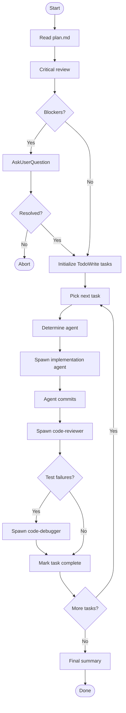

# Executing Plan

Execute an approved `plan.md` produced by the `planning` skill. Each task is delegated to the appropriate subagent, committed individually, and reviewed automatically before moving on.

Do **NOT** write implementation code directly — all code work is delegated to subagents.

## Quick Start

1. Have an approved `docs/features/<NNN>-<slug>/plan.md` ready
2. Invoke this skill: `/executing-plan docs/features/<NNN>-<slug>`
3. The skill reviews the plan, raises any concerns, then executes task by task

## Checklist

Use `TodoWrite` to create a todo for each item below and complete them in order.

1. **Locate plan**: Find `docs/features/<NNN>-<slug>/plan.md` — derive the feature path from the argument or context.
2. **Read plan**: Read the full plan including every task block.
3. **Critical review**: Scan the plan for blockers (see Review Checklist below).
4. **Raise concerns**: If blockers exist, present them via `AskUserQuestion` and get resolution before continuing. If none, proceed immediately.
5. **Initialize todos**: Extract every `### Task NNN:` block; create one `TodoWrite` entry per task.
6. **Execute tasks**: Work through tasks in order — delegate, wait for commit, review, then mark done.
7. **Final summary**: Report completed tasks, any debug cycles triggered, and unresolved concerns.

## Review Checklist

Before executing, scan for these blockers and surface them to the user:

- `[AMBIGUOUS: ...]` markers left by the task-decomposer agent
- Placeholder `<test-command>` or `path/to/` not yet filled in
- Files or modules referenced in tasks that do not exist in the codebase yet
- Tasks with more than 10 steps (likely too large — ask whether to split)
- Missing tech stack details (e.g., test runner unspecified, language version unknown)

Present all blockers in a single `AskUserQuestion` call — one question per distinct blocker type. Do not start execution until all blockers are resolved.

## Executing Each Task

For each task in the plan, follow this sequence:

1. **Determine agent** — read the task and reason about which agent best fits the work (see Agent Selection below)
2. **Spawn agent** — pass the full task block verbatim plus the absolute path to the feature directory
3. **Wait for commit** — the implementation agent commits as its final step; wait for the result
4. **Spawn code-reviewer** — always, after every implementation task, pass the list of modified files
5. **Handle failures** — if the agent reports test failures or errors, spawn `code-debugger` with the error output and file list before marking the task complete
6. **Mark complete** — update the `TodoWrite` entry to `completed`

## Agent Selection

For each task, read the task title, description, steps, and file list — then reason about which agent is the best fit for the work being done. Ask yourself: what is this task fundamentally about?

Available agents and what they are for:

- **`python-task-agent`** — writing or modifying Python source code, following TDD steps in a Python codebase
- **`coding-task-agent`** — writing or modifying source code in any other language, following TDD steps
- **`technical-writer`** — updating documentation, READMEs, changelogs, or inline doc comments; no executable code involved
- **`code-debugger`** — diagnosing and fixing a broken or failing implementation; the task exists because something isn't working

Do not reduce this to file extension matching. A task that updates a `.md` file as part of a code change may still be better suited for `coding-task-agent` if it involves technical decisions. A task that writes a Python script but is primarily about generating documentation output may suit `technical-writer`. Use your judgment.

After **every** implementation task (python, coding, or debugger) always also spawn `code-reviewer` on the modified files. Tasks handled by `technical-writer` do not need a code-reviewer pass.

## Process Flow

## Spawning Agents

When spawning implementation agents, provide:

1. The **full task block** from the plan (verbatim — steps, file paths, test skeleton, commit message hint)
2. The **absolute path to the feature directory** (e.g., `docs/features/001-oauth`) so the agent can locate design context if needed
3. Any **blocker resolutions** from step 4 that are relevant to the task (e.g., resolved test command)

When spawning `code-reviewer`, provide:

1. The **list of files modified** by the preceding implementation agent
2. Brief context: "Review files changed in Task NNN: [title]"

When spawning `code-debugger`, provide:

1. The **full error output or test failure log**
2. The **list of files involved**
3. Brief context: which task failed and what the implementation agent reported

## Guidelines

- Never write implementation code yourself — delegate all code work
- Ask one `AskUserQuestion` per blocker type, not per individual task
- If the plan has no `### Task NNN:` blocks, stop and inform the user the plan is empty or malformed
- If an agent returns without a commit (e.g., nothing changed), log it and move on — do not block
- Keep the user informed with brief status updates between tasks ("Executing Task 003: implement parse_token…")
