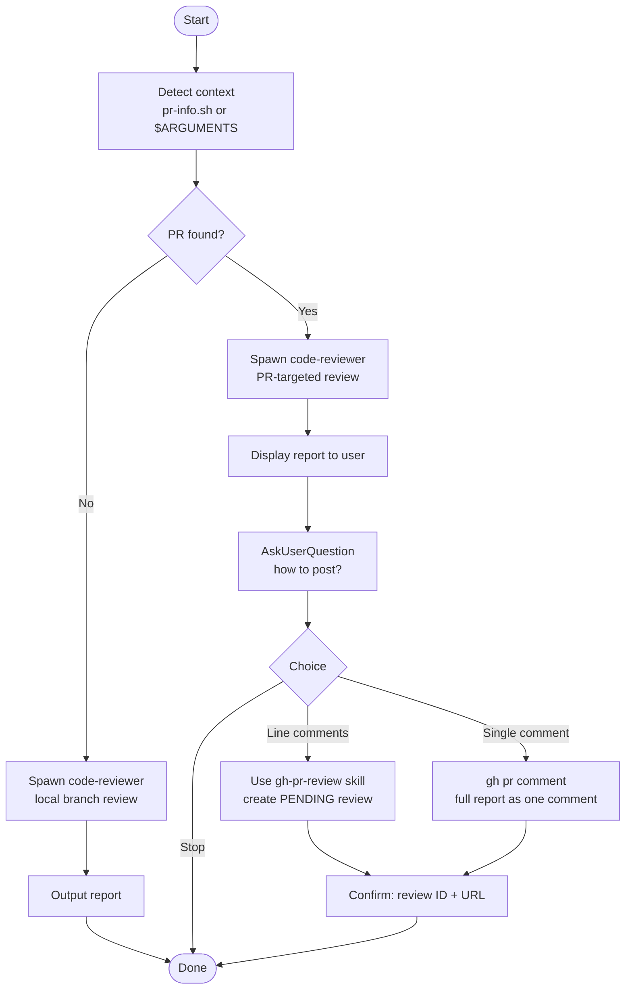

# Performing Code Review

Orchestrate a full code review: detect context, delegate to `code-reviewer`, display the report, then optionally publish to GitHub.

## Quick Start

```
/performing-code-review          # auto-detect context
/performing-code-review 123      # review PR #123 explicitly
```

## Process Flow



## Workflow

### Step 1: Detect Context

**If `$ARGUMENTS` is a number:** use it as the PR number directly — skip detection.

**Otherwise, run:**

```bash
${CLAUDE_SKILL_DIR}/scripts/pr-info.sh
```

- Output contains `"error": true` or `"code": "NO_PR"` → **local branch review**
- Output returns a valid `pr_number` → **PR review** with that number

If the script is not accessible, fall back to local branch review and note this to the user.

---

### Step 2: Delegate Review

Spawn `Agent(code-reviewer)` to perform the full review. **Do not use the `/code-review` skill or any other shortcut — always use `Agent(code-reviewer)` directly.**

- **Local:** `"Review the current branch changes using git diff."`
- **PR:** `"Review PR #<number>. Use git diff to identify the changed files and focus the review on those."`

Wait for the complete markdown report before continuing.

---

### Step 3: Output Report

Display the full markdown report to the user.

**Local branch review:** stop here.

**PR review:** continue to Step 4.

---

### Step 4: Ask How to Post (PR mode only)

Use `AskUserQuestion` to ask:

> "The review is ready. How would you like to post it to PR #[number]?"

Options:

1. **Line comments** — create a PENDING review with individual line-level comments (one per Critical Issue / Warning)
2. **Single comment** — post the full report as one PR comment
3. **Stop** — report shown above, no GitHub posting

---

### Step 5: Post to PR

#### Line comments

Use the `gh-pr-review` skill to create a PENDING review. Pass the report and PR number — the skill handles parsing findings and constructing the review. Only Critical Issues and Warnings become line comments; Suggestions are excluded.

After posting, inform the user:

```
## GitHub PR Review Created (PENDING)
PR #[number]: [url]
[N] line comments — not yet visible to the PR author.

Next steps: visit the PR, review comments, then click "Submit review".
```

#### Single comment

```bash
gh pr comment <pr_number> --body "<full markdown report>"
```

Inform the user with the comment URL returned by `gh`.

#### Stop

Nothing to do — report was already displayed.

---

## Edge Cases

| Situation | Behavior |
|-----------|----------|
| PR number passed but not found | Report error; fall back to local branch review |
| No git repository at all | Treat as local review; instruct `code-reviewer` to use Read/Glob instead of git diff |
| No local changes | Warn: "No changes found. Reviewing HEAD." Proceed. |
| `code-reviewer` returns no report | Report failure; do not attempt to post |
| `gh-pr-review` auth error | Tell user to run `gh auth login` |

## Requirements

- `code-reviewer` agent (installed via this plugin)
- `gh-pr-review` skill (installed via this plugin, for PR line comments)
- `gh` CLI authenticated (PR mode only)
- `jq` installed (PR mode only, used by pr-info.sh)
