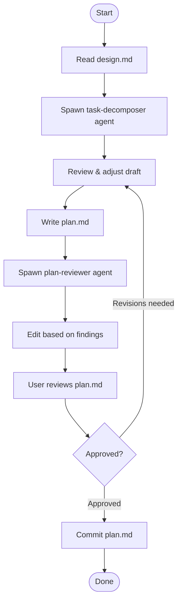

# Planning: Design Spec to Implementation Tasks

Translate an approved design specification into a concrete, ordered list of TDD implementation tasks. Each task is small enough to complete in 2–5 minutes, follows the red → green → commit cycle, and adheres to the `engineering-principles` skill.

Do **NOT** write any implementation code. This skill produces only `plan.md` — the full task list for implementation. Every line of code comes after the plan is approved.

## Quick Start

1. Have an approved `docs/features/<NNN>-<slug>/design.md` ready
2. Invoke this skill: `/planning docs/features/<NNN>-<slug>`
3. Output: `docs/features/<NNN>-<slug>/plan.md` — an ordered list of TDD tasks

## Checklist

You **MUST** use `TodoWrite` to create a task for each item below and complete them in order.

1. **Locate design spec**: Find `docs/features/<NNN>-<slug>/design.md` — derive the feature path from the argument or context.
2. **Read design spec**: Read the full spec: goals, architecture, component breakdown, and implementation notes.
3. **Spawn task-decomposer**: Delegate to the `task-decomposer` agent with the design spec path to produce a draft task list.
4. **Review draft**: Check the draft for task sizing, ordering, and format. Adjust as needed before writing the plan.
5. **Write plan**: Write to `docs/features/<NNN>-<slug>/plan.md` using [templates/plan.md](templates/plan.md).
6. **Spawn plan-reviewer**: Delegate to the `plan-reviewer` agent with the path to `plan.md`. Edit based on its findings.
7. **User review**: Use `AskUserQuestion` to present the plan path; iterate until the user approves.
8. **Commit**: Commit `plan.md` to git using the `git-commits` skill.

## Process Flow



## Decomposition Guidelines

### What counts as one task

A task is a single verifiable behavior — one function, one method, one endpoint, one data structure. If you cannot write a single test that captures it, it is either too small (merge it) or too large (split it).

**Rule of thumb:**

- One pure function with defined inputs/outputs → one task
- One data structure or type definition → one task (if it has testable logic)
- One API endpoint (routing + handler) → one task
- One integration point (DB query, external call) → one task
- Project scaffolding with no testable logic → bundle into a single setup task and mark as no-test

### Ordering rules

1. **Test infrastructure first** — if the project lacks a test runner or fixtures, task 001 sets them up
2. **Pure functions before consumers** — utilities and helpers before the code that calls them
3. **Data layer before business logic** — models and queries before services
4. **Business logic before transport** — services before controllers and handlers
5. **Happy path before edge cases** — implement the core behavior first, then add error handling in a separate task

### Applying engineering principles

Before writing a task, verify against the `engineering-principles` skill:

- **Single Responsibility** — the test should only assert one thing
- **Encapsulation** — the task's implementation should not leak internal state
- **YAGNI** — only implement what the design spec calls for
- **KISS** — if a task still feels large, split it into simpler steps

If a component in the spec has mixed responsibilities, split it before planning tasks.

## Task Format

Each task in the plan follows this structure:

````
### Task NNN: [Title]

**Files**:
- Create: `path/to/new_file.py`
- Modify: `path/to/existing_file.py`
- Test: `path/to/test_file.py`

- [ ] **Step 1**: Write failing test in `path/to/test_file.py`

  ```python
  def test_[behavior]():
      # arrange
      # act
      result = [function_under_test](...)
      # assert
      assert result == [expected]
  ```

- [ ] **Step 2**: Run `<test-command>` — confirm it fails

  Expected: `[failure message or assertion error]`

- [ ] **Step 3**: Write minimal implementation in `path/to/new_file.py`

  ```python
  def [name]([params]):
      # minimal implementation
      pass
  ```

- [ ] **Step 4**: Run `<test-command>` — confirm it passes

  Expected: `✓ [test name]`

- [ ] **Step 5**: Commit using the `git-commits` skill

  `git commit -m "<type>(<scope>): <message>"`
````

**Title conventions:**

- Start with an action verb: `add`, `implement`, `create`, `parse`, `validate`, `expose`
- Be specific: `implement parse_token(token)` not `add auth helper`

## Guidelines

- Do not write implementation code — this skill produces `plan.md` only
- If the design spec is missing a test command or tech stack detail, use `AskUserQuestion` before writing the plan
- If a component has no testable behavior (e.g., pure config), mark the task as `no-test` and explain why
- Use `AskUserQuestion` for all user-facing questions and decisions
- Ask one question at a time
