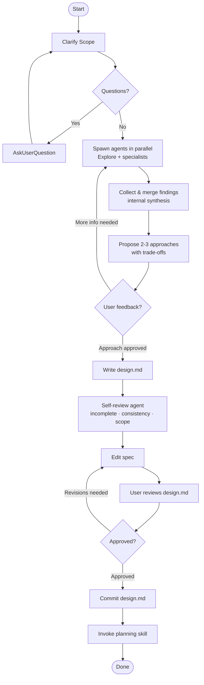

# Researching Ideas into Design Specifications

Help researching ideas into complete design specification through exploring the problem space, asking clarifying questions and gathering information.

Do **NOT** invoke any implementation skill, write any code or take any implementation action until you have a complete design specification that you have presented to the user and they have approved. This applies to EVERY task, regardless of how small or simple it may seem. Always start with research and design before any implementation.

## Checklist

You **MUST** use `TodoWrite` to create a task for each item in the checklist below and complete them in order. Do not skip any steps.

1. **Feature Numbering**: The next feature number is: !`${CLAUDE_SKILL_DIR}/scripts/next-feature-number.sh`. The feature directory will be: `docs/features/<NNN>-<feature-slug>/`.
2. **Clarify Scope**: Ask any clarifying questions, one at a time, until you have a complete understanding of the problem/requirements/success criteria.
3. **Exploration & Research**: Spawn parallel agents to explore the problem space and gather information.
4. **Propose 2-3 approaches**: Based on the research, propose 2-3 approaches with trade-offs and your recommendation.
5. **Present to User**: Use `AskUserQuestion` to present the proposed approaches and your recommendation. Ask the user to choose one or provide feedback until they approve an approach. If feedback requires more investigation, loop back to step 3.
6. **Write Design Spec**: Write a design specification for the chosen approach to `docs/features/<NNN>-<feature-slug>/design.md` using [templates/design-spec.md](templates/design-spec.md).
7. **Spec self-review**: Delegate to the `spec-reviewer` agent with the path to the written `design.md`. Edit the spec based on its findings until it is ready for the user.
8. **User reviews written spec**: Use `AskUserQuestion` to present the design spec to the user and ask for feedback. Edit as needed until the user approves the design spec.
9. **Commit design spec**: Commit `docs/features/<NNN>-<feature-slug>/design.md` to git using the `git-commits` skill.
10. **Transition to implementation**: Once the design spec is committed, invoke the planning skill to create an implementation plan.

## Process Flow

## The Process in Detail

### Understanding the Topic

- Before asking any detailed questions, assess the scope. If the request is too broad (e.g. "build an ecommerce platform"), flag this immediately. Don't spend time refining details of a project that needs to be decomposed.
- If the project is too large for a single specification, help the user break it down into smaller projects. What are the independent projects? How do they relate? In what order should they be tackled? Then research the first sub-project according to the process. Each sub-project should own its own research → plan → implement cycle.
- **ALWAYS** use `AskUserQuestion` when asking the user for information, feedback, or decisions. Never ask for input in the main conversation.
- Ask questions one at a time until you have a complete understanding of the problem, requirements, and success criteria. Do not proceed until you have all the information you need.

**What to clarify before researching:**

- What problem does this solve? Who experiences it?
- What does success look like? Are there acceptance criteria?
- Are there known constraints (tech stack, deadline, must-not-break areas)?
- Is this greenfield or modifying existing behaviour?

### Exploring the Problem Space

- Spawn agents **in parallel** within each round. Subsequent rounds should be targeted — only spawn agents needed to fill specific gaps identified after the previous round.
- Always include `Explore` in round 1. Add specialist agents when clearly relevant.
- When agents contradict, present both perspectives and flag the disagreement rather than guessing or trying to resolve it yourself.
- Prioritize codebase findings over external research. Always include concrete file paths and symbol names — no vague descriptions.
- Propose 2-3 approaches based on the research, with trade-offs.
- Lead with your recommendation and explain why. Don't just list options without guidance.

**Agents available for research:**

| Agent | When to Spawn | Agent file |
|-------|--------------|-----------|
| `Explore` (built-in) | **Always** in round 1 | [prompts/codebase-explorer.md](prompts/codebase-explorer.md) |
| `docs-library-researcher` | Libraries, frameworks, or doc lookup needed | [agents/research/docs-library-researcher.md](../../agents/research/docs-library-researcher.md) |
| `api-integration-researcher` | Feature involves external APIs or services | [agents/research/api-integration-researcher.md](../../agents/research/api-integration-researcher.md) |
| `architecture-researcher` | Significant architectural decisions involved | [agents/research/architecture-researcher.md](../../agents/research/architecture-researcher.md) |

### Presenting the Design

- Once you believe you understand what you're building, present the design
- Scale each section to its complexity: a few sentences if straightforward, up to 200-300 words if nuanced
- Ask after each section whether it looks right so far
- Cover: architecture, components, data flow, error handling, testing
- Be ready to go back and clarify if something doesn't make sense

### Design for Isolation and Clarity

When designing the solution, break the work into small, focused units:

- **Single responsibility**: each component does exactly one thing. If you can't name it in a few words, it's doing too much.
- **Well-defined interfaces**: components communicate through narrow, explicit contracts. Internals are hidden.
- **Independent testability**: a good unit can be understood and verified without knowing its neighbours.
- **Separation of concerns**: UI logic, business rules, and data access belong in separate layers. Mixing them makes every change risky.

Apply the `engineering-principles` skill when choosing between design approaches or making structural trade-offs.

Avoid designing for hypothetical future requirements. Three similar functions are better than a premature abstraction. Design for what is known now — the spec should reflect the agreed scope, not every possibility.

### Working in Existing Codebases

- Always explore before proposing. Find existing patterns and naming conventions. Follow them.
- Look for utilities or abstractions you can reuse instead of reimplementing
- **When existing code has problems that affect your work** (e.g., a file that has grown too large, unclear boundaries, tangled responsibilities), include targeted improvements as part of the design. This is how a good developer improves code they're working in.
- Do not propose unrelated refactoring. Stay focused on what serves the current goal.

## After the Design

### Documentation

- Use [templates/design-spec.md](templates/design-spec.md) as the template for the design spec. Write to `docs/features/<NNN>-<feature-slug>/design.md`.
- Commit the design spec to git.

### Spec Self-Review

- After writing `design.md`, delegate to the `spec-reviewer` agent with the path to the written file.
- Edit the spec based on the agent's findings before presenting it to the user.

### User Review

Use `AskUserQuestion` to present the design spec to the user and ask for feedback.

> "Spec is ready for review. Please read through `docs/features/<NNN>-<feature-slug>/design.md` and let me know if you have any feedback or if it's good to proceed with implementation planning."

Wait for user feedback. If the user requests changes, edit the spec accordingly and repeat the review process until the user approves the design spec.

### Handoff

- Once the design spec is approved, commit `docs/features/<NNN>-<feature-slug>/design.md` to git using the `git-commits` skill.
- Then invoke the planning skill to create an implementation plan.
- Do **NOT** invoke any other skill, planning is the next step.

## Guidelines

- Let the user drive research depth — don't auto-evaluate completeness.
- Ask one question at a time. Don't bombard the user with multiple questions at once.
- Multiple choice preferred when possible, but open-ended questions are fine if that's what's needed to clarify.
- Use `AskUserQuestion` for all user-facing questions and decisions.
- Apply the `engineering-principles` skill for structural and design trade-off decisions.
- Explore alternatives. Consider multiple approaches before recommending one.
- Incremental validation is better than waiting until the end. Check in with the user frequently to confirm you're on the right track.
